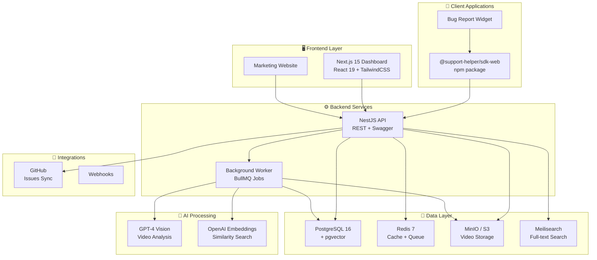

# Support Helper Platform

<div align="center">

[](https://github.com/your-org/support-helper/actions)
[](https://codecov.io/gh/your-org/support-helper)
[](https://opensource.org/licenses/MIT)
[](https://www.typescriptlang.org/)
[](https://nodejs.org/)
[](https://nestjs.com/)
[](https://nextjs.org/)

**AI-powered technical support platform enabling users to report bugs with video capture and automatic analysis.**

[🚀 Quick Start](QUICKSTART.md) • [Quick Start (5 min)](#quick-start-5-minutes) • [Documentation](#documentation) • [API Reference](docs/API.md) • [SDK Guide](docs/SDK.md)

</div>

---

## 🎯 Overview

Support Helper is a complete technical support solution that allows users to report issues with a single click. It captures screen recordings, collects system context, and uses AI to automatically analyze, classify, and prioritize bug reports.

## 🏗️ Architecture



## ✨ Features

| Feature | Description |
|---------|-------------|
| 🎥 **One-Click Bug Reporting** | Users capture screen recordings with a single click |
| 🤖 **AI-Powered Analysis** | GPT-4 Vision analyzes videos, extracts steps, classifies issues |
| 🏢 **Multi-Tenant SaaS** | Isolated data per organization with flexible pricing tiers |
| 🔗 **GitHub Integration** | Auto-create issues, link commits, two-way sync |
| 📊 **Real-Time Dashboard** | Modern Next.js dashboard with video playback |
| 📦 **SDK for Web Apps** | Lightweight SDK (`<50KB`) for easy integration |
| 🔍 **Smart Search** | Full-text + vector similarity search for tickets |
| 🔒 **Enterprise Security** | JWT auth, API keys, RBAC, data encryption |

## 🚀 Quick Start (5 minutes)

### Prerequisites

- **Node.js** >= 20.0.0
- **pnpm** >= 8.0.0
- **Docker** & Docker Compose
- **Git**

### 1. Clone and Install

```bash
git clone https://github.com/your-org/support-helper.git
cd support-helper
pnpm install
```

### 2. Configure Environment

```bash
cp .env.example .env.local
```

Edit `.env.local` with your configuration (defaults work for local development).

### 3. Start Infrastructure

```bash
pnpm docker:up
```

This starts PostgreSQL, Redis, MinIO, and Meilisearch.

### 4. Setup Database

```bash
pnpm db:migrate
pnpm db:seed
```

### 5. Start Development

```bash
pnpm dev
```

Access the applications:
- **Dashboard**: http://localhost:3000
- **API**: http://localhost:3001
- **API Docs**: http://localhost:3001/api/docs
- **MinIO Console**: http://localhost:9001 (minioadmin/minioadmin)

**Test credentials:**
- Email: `admin@example.com`
- Password: `password123`

## 📁 Architecture

```
support-helper/
├── apps/
│   ├── api/                 # NestJS backend API
│   │   ├── src/
│   │   │   ├── modules/     # Feature modules (tickets, media, auth...)
│   │   │   ├── common/      # Shared decorators, guards, filters
│   │   │   └── config/      # Configuration files
│   │   └── prisma/          # Database schema & migrations
│   ├── dashboard/           # Next.js 15 admin dashboard
│   │   └── app/             # App Router pages
│   ├── web/                 # Marketing website + docs
│   └── worker/              # Background job processor (BullMQ)
├── packages/
│   ├── sdk-web/             # Client SDK for web apps
│   ├── shared/              # Shared TypeScript types & utilities
│   └── database/            # Database utilities & types
├── docker/                  # Docker configurations
└── docs/                    # Project documentation
```

> 📖 See [ARCHITECTURE.md](docs/ARCHITECTURE.md) for detailed architecture documentation.

## 💻 Development

### Available Scripts

| Command | Description |
|---------|-------------|
| `pnpm dev` | Start all services in development mode |
| `pnpm build` | Build all packages |
| `pnpm test` | Run all tests |
| `pnpm test:coverage` | Run tests with coverage report |
| `pnpm lint` | Lint all packages |
| `pnpm format` | Format code with Prettier |
| `pnpm type-check` | TypeScript type checking |
| `pnpm db:migrate` | Run database migrations |
| `pnpm db:seed` | Seed database with test data |
| `pnpm db:studio` | Open Prisma Studio GUI |
| `pnpm docker:up` | Start infrastructure containers |
| `pnpm docker:down` | Stop infrastructure containers |
| `pnpm docker:clean` | Remove containers and volumes |
| `pnpm clean` | Clean all build artifacts and caches |

### Package-Specific Commands

```bash
# API
pnpm --filter @support-helper/api dev
pnpm --filter @support-helper/api test:e2e

# Dashboard
pnpm --filter @support-helper/dashboard dev
pnpm --filter @support-helper/dashboard build

# SDK
pnpm --filter @support-helper/sdk-web build
pnpm --filter @support-helper/sdk-web test
```

### Database Operations

```bash
pnpm db:migrate       # Apply migrations
pnpm db:generate      # Regenerate Prisma client
pnpm db:seed          # Seed test data
pnpm db:studio        # Open database GUI
```

## SDK Integration

Install the SDK in your web application:

```bash
npm install @support-helper/sdk-web
```

Basic usage:

```typescript
import { SupportHelper } from '@support-helper/sdk-web';

const supportHelper = new SupportHelper({
  sdkKey: 'your-sdk-key',
  apiUrl: 'https://api.support-helper.com',
});

// Start recording
await supportHelper.startRecording();

// Stop and submit report
const videoBlob = await supportHelper.stopRecording();
const ticketId = await supportHelper.report({
  title: 'Button not working',
  description: 'The submit button does not respond to clicks',
  includeVideo: true,
});
```

See [SDK Documentation](packages/sdk-web/README.md) for complete integration guide including React, Vue, Angular and Vanilla JS examples.

## 🛠️ Tech Stack

| Layer | Technology |
|-------|------------|
| **Frontend** | Next.js 15, React 19, TailwindCSS 4, TanStack Query/Table/Form, Zustand 5 |
| **Backend** | NestJS 10, Prisma 5, PostgreSQL 16, Redis 7, BullMQ |
| **AI/ML** | OpenAI GPT-4 Vision, Embeddings, pgvector |
| **Storage** | MinIO (S3-compatible), PostgreSQL |
| **Search** | Meilisearch |
| **Auth** | JWT, Passport.js, bcrypt |
| **Monitoring** | Sentry, OpenTelemetry (optional) |
| **Infrastructure** | Docker, Turborepo, pnpm workspaces |

## 📚 Documentation

| Document | Description |
|----------|-------------|
| [🚀 Quick Start](QUICKSTART.md) | **Get running in 5 minutes** |
| [Architecture](docs/ARCHITECTURE.md) | System design, data flow, and infrastructure |
| [API Reference](docs/API.md) | Complete REST API documentation |
| [SDK Guide](docs/SDK.md) | SDK integration with all frameworks |
| [Deployment](docs/DEPLOYMENT.md) | Production deployment (Vercel + Railway) |
| [Contributing](docs/CONTRIBUTING.md) | Development guidelines and workflow |
| [Testing](docs/TESTING.md) | Testing strategy, mocking, CI/CD |
| [Security](docs/SECURITY.md) | Security best practices and compliance |

### Package Documentation

| Package | Description |
|---------|-------------|
| [apps/api](apps/api/README.md) | Backend API architecture & module guide |
| [apps/web](apps/web/README.md) | Frontend patterns & TanStack best practices |
| [apps/worker](apps/worker/README.md) | Background job processing with BullMQ |
| [packages/sdk-web](packages/sdk-web/README.md) | SDK installation & framework examples |

## 🔧 Troubleshooting

<details>
<summary><strong>🔴 Port conflicts</strong></summary>

Check if ports are in use:
```bash
# Linux/macOS
lsof -i :3000 -i :3001 -i :5432 -i :6379 -i :9000

# Windows PowerShell
Get-NetTCPConnection -LocalPort 3000,3001,5432,6379,9000 -ErrorAction SilentlyContinue
```

| Service | Default Port |
|---------|-------------|
| Dashboard | 3000 |
| API | 3001 |
| PostgreSQL | 5432 |
| Redis | 6379 |
| MinIO | 9000 / 9001 (console) |

</details>

<details>
<summary><strong>🔴 Prisma client not generated</strong></summary>

```bash
pnpm db:generate
```

</details>

<details>
<summary><strong>🔴 CORS issues</strong></summary>

Ensure `DASHBOARD_URL` in `.env.local` matches your frontend URL exactly (including protocol and port).

</details>

<details>
<summary><strong>🔴 Docker issues</strong></summary>

```bash
# Remove containers and volumes, then restart
pnpm docker:down
docker volume prune -f
pnpm docker:up

# Check container logs
docker-compose logs -f postgres
docker-compose logs -f redis
docker-compose logs -f minio
```

</details>

<details>
<summary><strong>🔴 Turbo cache issues</strong></summary>

```bash
pnpm clean  # Clear all caches and node_modules
pnpm install
pnpm build
```

</details>

<details>
<summary><strong>🔴 Database connection failed</strong></summary>

1. Ensure Docker is running: `docker ps`
2. Check PostgreSQL is healthy: `docker-compose ps`
3. Verify `DATABASE_URL` in `.env.local`
4. Try resetting: `pnpm db:migrate:reset`

</details>

<details>
<summary><strong>🔴 MinIO/S3 upload errors</strong></summary>

1. Access MinIO Console: http://localhost:9001 (minioadmin/minioadmin)
2. Verify bucket exists: `support-helper`
3. Check S3 credentials in `.env.local`

</details>

## 🤝 Contributing

We welcome contributions! Please see our [Contributing Guide](docs/CONTRIBUTING.md) for details.

1. Fork the repository
2. Create a feature branch (`git checkout -b feature/amazing-feature`)
3. Commit your changes (`git commit -m 'Add amazing feature'`)
4. Push to the branch (`git push origin feature/amazing-feature`)
5. Open a Pull Request

## 📄 License

This project is licensed under the MIT License - see the [LICENSE](LICENSE) file for details.

## 💬 Support

| Channel | Link |
|---------|------|
| 📖 Documentation | [docs/](docs/) |
| 🐛 Bug Reports | [GitHub Issues](https://github.com/your-org/support-helper/issues) |
| 💡 Feature Requests | [GitHub Discussions](https://github.com/your-org/support-helper/discussions) |
| 💬 Community | [Discord](https://discord.gg/support-helper) |

---
## 🏆 Hall of Fame: The Silicon Saviors

This project is fueled by coffee, tears, and the incredible generosity of the community. Special thanks to those helping me unlock **Claude Code Max** and saving my sanity.

### 🥇 Heroic Donors
| Name | Title | Special Contribution |
| :--- | :--- | :--- |
| **Hackick** | **Donator Heroïque** | Dried Claude's pixels and saved the production environment. |

---

### 🛠️ The "Hackick" Legacy
As promised in the 10€ tier, a **Sacred Bug** has been preserved in honor of **Hackick**. 

- **Status:** `WONTFIX / FEATURE`
- **Description:** A minor UI alignment issue that serves as a permanent monument to human kindness. 
- **Instruction:** Do not debug. This is a load-bearing emotional bug.

<div align="center">

**Built with ❤️ by the Support Helper Team**

[⬆ Back to Top](#support-helper-platform)

</div>
