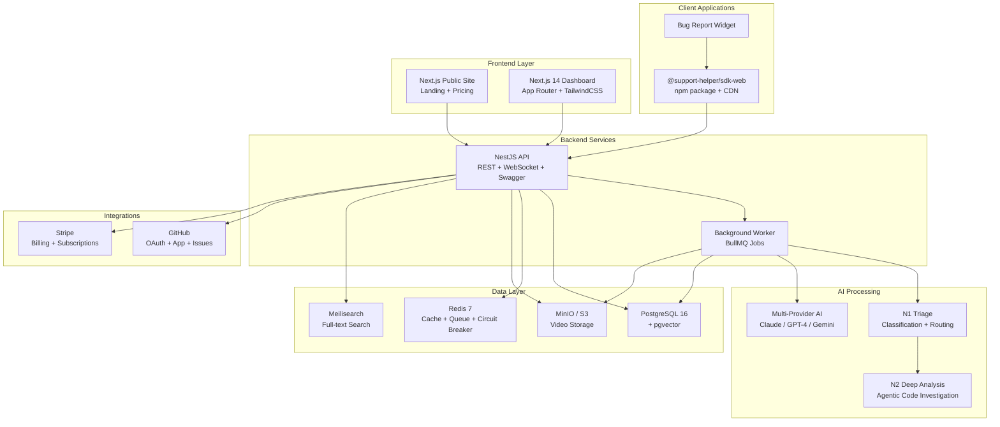

# Support Helper Platform

<div align="center">

[](https://www.typescriptlang.org/)
[](https://nodejs.org/)
[](https://nestjs.com/)
[](https://nextjs.org/)
[](https://opensource.org/licenses/MIT)

**AI-powered technical support platform enabling users to report bugs with video capture and automatic analysis.**

[Quick Start](QUICKSTART.md) | [Documentation](#documentation) | [API Reference](docs/API.md) | [SDK Guide](docs/SDK.md)

</div>

---

## Overview

Support Helper is a complete technical support solution that allows users to report issues with a single click. It captures screen recordings, collects system context, and uses AI to automatically analyze, classify, and prioritize bug reports.

### Key capabilities

- **One-click bug reporting** — Users capture screen recordings via a lightweight SDK widget
- **Multi-provider AI analysis** — GPT-4 Vision, Claude (Anthropic & Bedrock), Gemini 2.0 Flash, Ollama
- **Two-level autonomous triage** — N1 fast triage + N2 deep analysis with agentic code investigation
- **Multi-tenant SaaS** — Isolated data per organization with free/pro/enterprise plans
- **GitHub integration** — OAuth + App installation, auto-create issues, two-way sync
- **Stripe billing** — Subscription management with checkout, portal, and webhooks
- **Real-time dashboard** — Next.js dashboard with WebSocket updates and live activity feed
- **Smart search** — Full-text (Meilisearch) + vector similarity (pgvector) search
- **Offline-capable SDK** — IndexedDB queue with exponential backoff for offline reports

## Architecture



## Quick Start (5 minutes)

### Prerequisites

- **Node.js** >= 20.0.0
- **pnpm** >= 9.0.0
- **Docker** & Docker Compose
- **Git**

### 1. Clone and Install

```bash
git clone https://github.com/KJ-devs/supportHelperv2.git
cd supportHelperv2
pnpm install
```

### 2. Configure Environment

```bash
cp .env.example .env.local
```

Edit `.env.local` with your configuration (defaults work for local development).

### 3. Start Infrastructure

```bash
pnpm docker:up
```

This starts PostgreSQL, Redis, MinIO, Meilisearch, and MailHog.

### 4. Setup Database

```bash
pnpm db:migrate
pnpm db:seed
```

### 5. Start Development

```bash
pnpm dev
```

Access the applications:

- **Dashboard**: http://localhost:3000
- **API**: http://localhost:3001
- **Public Site**: http://localhost:3002
- **API Docs**: http://localhost:3001/api/docs
- **MinIO Console**: http://localhost:9001 (minioadmin/minioadmin)
- **MeiliSearch**: http://localhost:7700
- **MailHog**: http://localhost:8025

**Test credentials:**

- Email: `owner@test.local`
- Password: `password123`

## Project Structure

```
support-helper/
├── apps/
│   ├── api/                 # NestJS backend API (port 3001)
│   │   ├── src/
│   │   │   ├── modules/     # Feature modules (tickets, agent-v2, billing, triage...)
│   │   │   ├── ai/          # AI providers, caching, circuit breaker, model tiering
│   │   │   ├── common/      # Shared decorators, guards, filters
│   │   │   └── config/      # Configuration & env validation
│   │   └── prisma/          # Database schema & migrations
│   ├── dashboard/           # Next.js 14 internal dashboard (port 3000)
│   │   ├── app/             # App Router pages
│   │   ├── components/      # UI components
│   │   └── e2e/             # Playwright e2e tests
│   ├── web/                 # Next.js public website (port 3002)
│   └── worker/              # BullMQ background job processor
│       └── src/workers/     # Triage, deep-analysis, video-analysis, sync workers
├── packages/
│   ├── sdk-web/             # Client SDK for web apps (npm + CDN)
│   ├── shared/              # Shared TypeScript types (AgentHandoffContext, etc.)
│   └── database/            # Database utilities
├── docs/                    # Project documentation
└── docker-compose.yml       # PostgreSQL, Redis, MinIO, Meilisearch, MailHog
```

## AI Pipeline

Support Helper uses a two-level autonomous triage system:

```
Ticket Created
    │
    ▼
┌──────────────┐
│  N1 Triage   │  Fast classification (type, severity, priority)
│  (seconds)   │  Routes to: auto-resolve, N2, or human
└──────┬───────┘
       │
       ▼
┌──────────────┐
│ N2 Deep      │  Agentic code investigation via GitHub
│ Analysis     │  Tools: read_file, search_code, list_directory, edit_file
│ (minutes)    │  Generates root cause + action plan + optional PR
└──────────────┘
```

**Supported AI providers:**

| Provider           | Use Case            | Model                                |
| ------------------ | ------------------- | ------------------------------------ |
| Anthropic (Claude) | Investigation, chat | Claude Sonnet                        |
| OpenAI             | Vision, embeddings  | GPT-4 Vision, text-embedding-3-small |
| Google (Gemini)    | Vision, enrichment  | Gemini 2.0 Flash                     |
| AWS Bedrock        | Claude via AWS      | Claude (IAM auth)                    |
| Ollama             | Self-hosted / local | Any compatible model                 |

Model tiering routes tasks to the optimal provider automatically. Tenants can bring their own keys (BYOK) via the settings page.

## Development

### Available Scripts

| Command             | Description                             |
| ------------------- | --------------------------------------- |
| `pnpm dev`          | Start all services in development mode  |
| `pnpm build`        | Build all packages                      |
| `pnpm lint`         | Lint all packages                       |
| `pnpm format`       | Format code with Prettier               |
| `pnpm db:migrate`   | Run database migrations                 |
| `pnpm db:generate`  | Regenerate Prisma client (API + Worker) |
| `pnpm db:seed`      | Seed database with test data            |
| `pnpm db:studio`    | Open Prisma Studio GUI                  |
| `pnpm docker:up`    | Start infrastructure containers         |
| `pnpm docker:down`  | Stop infrastructure containers          |
| `pnpm docker:clean` | Remove containers and volumes           |
| `pnpm clean`        | Clean all build artifacts and caches    |

### Package-Specific Commands

```bash
# API
pnpm --filter @support-helper/api dev
pnpm --filter @support-helper/api test -- --maxWorkers=2

# Dashboard
pnpm --filter @support-helper/dashboard dev
pnpm --filter @support-helper/dashboard test

# Worker
pnpm --filter @support-helper/worker test -- --maxWorkers=2

# SDK
pnpm --filter @support-helper/sdk-web build
pnpm --filter @support-helper/sdk-web build:cdn
```

### Testing

- **API + Worker**: Jest (`*.spec.ts`) — always use `--maxWorkers=2` to limit RAM
- **Dashboard**: Vitest (`*.test.ts`) + Playwright e2e
- **Never run `pnpm test` globally** — it launches all suites in parallel and exhausts RAM

```bash
# Run tests for a single package
pnpm --filter @support-helper/api test -- --maxWorkers=2
pnpm --filter @support-helper/dashboard test

# Run only changed tests (fastest)
cd apps/api && npx jest --maxWorkers=2 --no-coverage --changedSince=HEAD~1
cd apps/dashboard && npx vitest run --no-coverage --changed

# Playwright e2e
cd apps/dashboard && npx playwright test
```

## SDK Integration

Install the SDK in your web application:

```bash
npm install @support-helper/sdk-web
```

Basic usage:

```typescript
import { SupportHelper } from '@support-helper/sdk-web';

const supportHelper = new SupportHelper({
  sdkKey: 'your-sdk-key',
  apiUrl: 'https://api.your-domain.com',
});

// Programmatic report with video
const result = await supportHelper.reportWithVideo({
  title: 'Button not working',
  description: 'The submit button does not respond to clicks',
});

console.log(result.ticketId); // Track the ticket
```

The SDK also provides a `<support-helper>` Web Component with Shadow DOM for drop-in widget integration. Reports are queued offline via IndexedDB and auto-submitted on reconnect.

See [SDK Documentation](packages/sdk-web/README.md) for complete integration guide.

## Tech Stack

| Layer              | Technology                                                                   |
| ------------------ | ---------------------------------------------------------------------------- |
| **Public Site**    | Next.js 14, TailwindCSS                                                      |
| **Dashboard**      | Next.js 14, TailwindCSS, TanStack Query, Zustand, socket.io-client           |
| **Backend**        | NestJS 10, Prisma ORM, PostgreSQL 16, Redis 7, BullMQ, Socket.io             |
| **AI/ML**          | Claude (Anthropic/Bedrock), GPT-4 Vision, Gemini 2.0 Flash, Ollama, pgvector |
| **Storage**        | MinIO (S3-compatible)                                                        |
| **Search**         | Meilisearch                                                                  |
| **Auth**           | JWT, Passport.js, SDK key (`x-sdk-key`), internal service JWT                |
| **Billing**        | Stripe (subscriptions, checkout, webhooks)                                   |
| **Monitoring**     | Sentry, PostHog, BetterStack                                                 |
| **Email**          | Resend, MailHog (dev)                                                        |
| **Infrastructure** | Docker, Turborepo, pnpm 9 workspaces                                         |
| **Testing**        | Jest, Vitest, Playwright                                                     |

## Documentation

| Document                                         | Description                                  |
| ------------------------------------------------ | -------------------------------------------- |
| [Quick Start](QUICKSTART.md)                     | Get running in 5 minutes                     |
| [Architecture](docs/ARCHITECTURE.md)             | System design, data flow, and infrastructure |
| [API Reference](docs/API.md)                     | Complete REST API documentation              |
| [SDK Guide](docs/SDK.md)                         | SDK integration with all frameworks          |
| [User Guide](docs/USER_GUIDE.md)                 | End-user documentation                       |
| [Deployment](docs/DEPLOYMENT.md)                 | Production deployment guide                  |
| [Self-Hosted](docs/self-hosted/)                 | Self-hosted deployment instructions          |
| [GitHub OAuth Setup](docs/GITHUB_OAUTH_SETUP.md) | GitHub App & OAuth configuration             |
| [Integrations](docs/INTEGRATION_PROVIDERS.md)    | Third-party integration providers            |
| [Rate Limiting](docs/RATE_LIMITING.md)           | API rate limiting configuration              |
| [Monitoring](docs/SETUP_MONITORING.md)           | Sentry, PostHog, BetterStack setup           |
| [Security](docs/SECURITY.md)                     | Security best practices and compliance       |
| [Testing](docs/TESTING.md)                       | Testing strategy and CI/CD                   |
| [Contributing](docs/CONTRIBUTING.md)             | Development guidelines and workflow          |

## Troubleshooting

<details>
<summary><strong>Port conflicts</strong></summary>

| Service       | Default Port            |
| ------------- | ----------------------- |
| Dashboard     | 3000                    |
| API           | 3001                    |
| Public Site   | 3002                    |
| Worker Health | 3003                    |
| PostgreSQL    | 5432                    |
| Redis         | 6379                    |
| MinIO         | 9000 / 9001 (console)   |
| MeiliSearch   | 7700                    |
| MailHog       | 8025 (UI) / 1025 (SMTP) |

```bash
# Check ports in use (Windows PowerShell)
Get-NetTCPConnection -LocalPort 3000,3001,5432,6379,9000 -ErrorAction SilentlyContinue

# Linux/macOS
lsof -i :3000 -i :3001 -i :5432 -i :6379 -i :9000
```

</details>

<details>
<summary><strong>Prisma client not generated</strong></summary>

```bash
pnpm db:generate
```

</details>

<details>
<summary><strong>CORS issues</strong></summary>

Ensure `DASHBOARD_URL` in `.env.local` matches your frontend URL exactly (including protocol and port).

</details>

<details>
<summary><strong>Docker issues</strong></summary>

```bash
# Remove containers and volumes, then restart
pnpm docker:down
docker volume prune -f
pnpm docker:up

# Check container logs
docker-compose logs -f postgres
docker-compose logs -f redis
docker-compose logs -f minio
```

</details>

<details>
<summary><strong>Turbo cache issues</strong></summary>

```bash
pnpm clean
pnpm install
pnpm build
```

</details>

<details>
<summary><strong>Database connection failed</strong></summary>

1. Ensure Docker is running: `docker ps`
2. Check PostgreSQL is healthy: `docker-compose ps`
3. Verify `DATABASE_URL` in `.env.local`
4. Try resetting: `pnpm db:migrate:reset`

</details>

<details>
<summary><strong>SDK widget not rendering</strong></summary>

The CDN bundle must be built separately:

```bash
pnpm --filter @support-helper/sdk-web build:cdn
```

Verify `packages/sdk-web/dist/cdn/sdk.iife.js` exists after the build.

</details>

## Contributing

We welcome contributions! Please see our [Contributing Guide](docs/CONTRIBUTING.md) for details.

1. Fork the repository
2. Create a feature branch (`git checkout -b feature/amazing-feature`)
3. Commit your changes (`git commit -m 'Add amazing feature'`)
4. Push to the branch (`git push origin feature/amazing-feature`)
5. Open a Pull Request

## License

This project is licensed under the MIT License - see the [LICENSE](LICENSE) file for details.

## Support

| Channel          | Link                                                                         |
| ---------------- | ---------------------------------------------------------------------------- |
| Documentation    | [docs/](docs/)                                                               |
| Bug Reports      | [GitHub Issues](https://github.com/KJ-devs/supportHelperv2/issues)           |
| Feature Requests | [GitHub Discussions](https://github.com/KJ-devs/supportHelperv2/discussions) |

---

## Hall of Fame: The Silicon Saviors

This project is fueled by coffee, tears, and the incredible generosity of the community. Special thanks to those helping me unlock **Claude Code Max** and saving my sanity.

### Heroic Donors

| Name        | Title                | Special Contribution                                        |
| :---------- | :------------------- | :---------------------------------------------------------- |
| **Hackick** | **Donator Heroique** | Dried Claude's pixels and saved the production environment. |

---

### The "Hackick" Legacy

As promised in the 10 EUR tier, a **Sacred Bug** has been preserved in honor of **Hackick**.

- **Status:** `WONTFIX / FEATURE`
- **Description:** A minor UI alignment issue that serves as a permanent monument to human kindness.
- **Instruction:** Do not debug. This is a load-bearing emotional bug.

<div align="center">

**Built with love by the Support Helper Team**

[Back to Top](#support-helper-platform)

</div>
