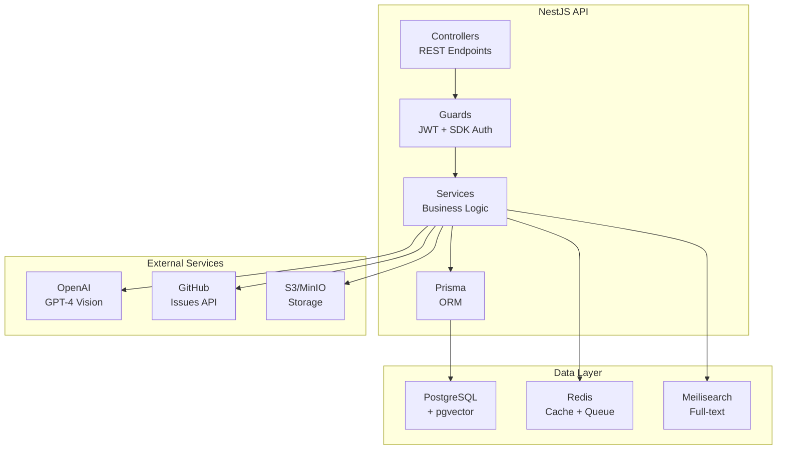

# @support-helper/api

<div align="center">

[](https://nestjs.com/)
[](https://www.prisma.io/)
[](https://www.typescriptlang.org/)
[](https://www.postgresql.org/)
[](https://redis.io/)

**Backend API for Support Helper Platform**

[API Docs (Swagger)](http://localhost:3001/api/docs) • [Architecture](../../docs/ARCHITECTURE.md) • [Testing Guide](../../docs/TESTING.md)

</div>

---

## 🎯 Overview

The API provides:
- 🔐 RESTful endpoints for ticket management
- 🔑 JWT authentication for dashboard users
- 🔌 SDK key authentication for client applications
- 🤖 AI-powered video analysis integration
- 🔗 GitHub integration for issue tracking
- ☁️ Pre-signed URL generation for S3 uploads
- 🔍 Full-text + vector similarity search

## 🏗️ Architecture



## 📁 Module Structure

```
src/
├── modules/               # Feature modules
│   ├── auth/             # Authentication (JWT, SDK keys)
│   ├── tickets/          # Ticket CRUD and search
│   ├── media/            # File uploads and processing
│   ├── github/           # GitHub integration
│   ├── agent/            # AI agent conversations
│   └── analytics/        # Dashboard analytics
├── common/               # Shared utilities
│   ├── decorators/       # Custom decorators (@CurrentUser, @Public)
│   ├── guards/           # Auth guards (JWT, SDK key, Roles)
│   ├── filters/          # Exception filters
│   ├── interceptors/     # Logging, transform
│   └── pipes/            # Validation pipes
├── config/               # Configuration modules
│   ├── app.config.ts     # Application config
│   ├── database.config.ts
│   ├── jwt.config.ts
│   ├── s3.config.ts
│   └── openai.config.ts
└── prisma/               # Database service & client
```

## 🚀 Getting Started

### 📋 Prerequisites

- Node.js >= 20.0.0
- pnpm >= 8.0.0
- PostgreSQL 16+ (via Docker)
- Redis 7+ (via Docker)
- MinIO or S3-compatible storage (via Docker)

### ⚡ Development

```bash
# From project root
pnpm docker:up          # Start infrastructure
pnpm db:migrate         # Run migrations
pnpm db:seed            # Seed test data

# Start API in watch mode
pnpm --filter @support-helper/api dev
```

| URL | Description |
|-----|-------------|
| http://localhost:3001 | API Base URL |
| http://localhost:3001/api/docs | Swagger UI |
| http://localhost:3001/api/health | Health Check |

### 🔑 Test Credentials

```
Email: admin@example.com
Password: password123
```

## 📦 Modules Documentation

### Auth Module

Handles authentication and authorization.

```typescript
// JWT authentication for dashboard users
@UseGuards(JwtAuthGuard)
@Get('profile')
async getProfile(@CurrentUser() user: UserPayload) {
  return user;
}

// SDK key authentication for SDK clients
@UseGuards(SdkKeyGuard)
@Post('tickets')
async createFromSdk(@SdkPayload() sdk: SdkPayloadInterface) {
  // sdk.tenantId, sdk.applicationId available
}
```

**Files:**
- `auth.controller.ts` - Login, register, profile endpoints
- `auth.service.ts` - Token generation, validation
- `strategies/jwt.strategy.ts` - JWT validation
- `strategies/sdk-key.strategy.ts` - SDK key validation
- `guards/jwt-auth.guard.ts` - JWT protection
- `guards/sdk-key.guard.ts` - SDK protection

### Tickets Module

CRUD operations and search for tickets.

```typescript
// Get all tickets for tenant
GET /api/tickets

// Get ticket by ID
GET /api/tickets/:id

// Create ticket (dashboard)
POST /api/tickets

// Create ticket (SDK)
POST /api/sdk/tickets

// Update ticket
PATCH /api/tickets/:id

// Assign ticket
POST /api/tickets/:id/assign

// Search tickets
GET /api/tickets/search?q=query
```

**Files:**
- `tickets.controller.ts` - Dashboard endpoints
- `sdk-tickets.controller.ts` - SDK endpoints
- `tickets.service.ts` - Business logic
- `tickets-ai.service.ts` - AI analysis integration
- `dto/*.dto.ts` - Request/response DTOs

### Media Module

File upload handling with S3 pre-signed URLs.

```typescript
// Request upload URL
POST /api/media/upload-url
{
  "ticketId": "uuid",
  "type": "video",
  "filename": "recording.webm",
  "contentType": "video/webm",
  "size": 5242880
}

// Response
{
  "uploadUrl": "https://s3.../presigned",
  "mediaId": "uuid",
  "storageKey": "videos/...",
  "expiresAt": "..."
}

// Confirm upload
POST /api/media/:id/confirm
```

**Files:**
- `media.controller.ts` - Upload endpoints
- `media.service.ts` - Media management
- `s3.service.ts` - S3 operations
- `ffprobe.service.ts` - Video metadata extraction

### GitHub Module

GitHub App integration for issue management.

```typescript
// Connect GitHub
POST /api/github/connect

// List connected repos
GET /api/github/repos

// Create issue from ticket
POST /api/github/issues
{
  "ticketId": "uuid",
  "repo": "owner/repo"
}

// Webhook handler
POST /api/github/webhook
```

## Adding New Features

### Creating a New Module

```bash
# Generate module, service, and controller
nest generate module modules/feature-name
nest generate service modules/feature-name
nest generate controller modules/feature-name
```

### Module Template

```typescript
// feature.module.ts
import { Module } from '@nestjs/common';
import { FeatureController } from './feature.controller';
import { FeatureService } from './feature.service';
import { PrismaModule } from '../../prisma/prisma.module';

@Module({
  imports: [PrismaModule],
  controllers: [FeatureController],
  providers: [FeatureService],
  exports: [FeatureService],
})
export class FeatureModule {}
```

### Controller Template

```typescript
// feature.controller.ts
import { Controller, Get, Post, Body, UseGuards } from '@nestjs/common';
import { ApiTags, ApiBearerAuth } from '@nestjs/swagger';
import { JwtAuthGuard } from '../auth/guards/jwt-auth.guard';
import { CurrentUser } from '../../common/decorators';
import { FeatureService } from './feature.service';
import { CreateFeatureDto } from './dto/create-feature.dto';

@ApiTags('Feature')
@ApiBearerAuth()
@Controller('feature')
@UseGuards(JwtAuthGuard)
export class FeatureController {
  constructor(private readonly featureService: FeatureService) {}

  @Get()
  async findAll(@CurrentUser() user: UserPayload) {
    return this.featureService.findAll(user.tenantId);
  }

  @Post()
  async create(
    @CurrentUser() user: UserPayload,
    @Body() dto: CreateFeatureDto,
  ) {
    return this.featureService.create(user.tenantId, dto);
  }
}
```

### Service Template

```typescript
// feature.service.ts
import { Injectable } from '@nestjs/common';
import { PrismaService } from '../../prisma/prisma.service';

@Injectable()
export class FeatureService {
  constructor(private prisma: PrismaService) {}

  async findAll(tenantId: string) {
    return this.prisma.feature.findMany({
      where: { tenantId },
    });
  }

  async create(tenantId: string, data: CreateFeatureDto) {
    return this.prisma.feature.create({
      data: {
        ...data,
        tenantId,
      },
    });
  }
}
```

### DTO Template

```typescript
// dto/create-feature.dto.ts
import { IsString, IsOptional, MaxLength } from 'class-validator';
import { ApiProperty } from '@nestjs/swagger';

export class CreateFeatureDto {
  @ApiProperty({ description: 'Feature name' })
  @IsString()
  @MaxLength(255)
  name: string;

  @ApiProperty({ required: false })
  @IsOptional()
  @IsString()
  @MaxLength(1000)
  description?: string;
}
```

## Database

### Schema Location

`prisma/schema.prisma`

### Migrations

```bash
# Create migration
pnpm --filter @support-helper/api db:migrate

# Generate Prisma client
pnpm --filter @support-helper/api db:generate

# Open Prisma Studio
pnpm --filter @support-helper/api db:studio

# Seed database
pnpm --filter @support-helper/api db:seed
```

### Adding New Models

1. Edit `prisma/schema.prisma`:

```prisma
model NewModel {
  id        String   @id @default(dbgenerated("uuid_generate_v4()")) @db.Uuid
  tenantId  String   @map("tenant_id") @db.Uuid
  name      String   @db.VarChar(255)
  createdAt DateTime @default(now()) @map("created_at")

  tenant Tenant @relation(fields: [tenantId], references: [id])

  @@index([tenantId])
  @@map("new_models")
}
```

2. Run migration:
```bash
pnpm db:migrate
```

3. Update seed file if needed:
```bash
# prisma/seed.ts
```

## Testing

### Unit Tests

```bash
pnpm --filter @support-helper/api test
pnpm --filter @support-helper/api test:watch
pnpm --filter @support-helper/api test:coverage
```

### E2E Tests

```bash
pnpm --filter @support-helper/api test:e2e
```

### Test Structure

```
test/
├── unit/
│   └── services/
│       └── tickets.service.spec.ts
├── integration/
│   └── tickets.integration.spec.ts
├── e2e/
│   └── tickets.e2e-spec.ts
├── fixtures/
│   └── tickets.fixture.ts
└── helpers/
    └── test-app.ts
```

## Configuration

### Environment Variables

```env
# Database
DATABASE_URL=postgresql://...

# Redis
REDIS_URL=redis://localhost:6379

# Auth
JWT_SECRET=your-secret
JWT_EXPIRES_IN=7d

# S3/MinIO
S3_ENDPOINT=http://localhost:9000
S3_ACCESS_KEY=minioadmin
S3_SECRET_KEY=minioadmin
S3_BUCKET=videos

# OpenAI
OPENAI_API_KEY=sk-...

# App
NODE_ENV=development
API_PORT=3001
DASHBOARD_URL=http://localhost:3000
```

### Configuration Files

- `config/app.config.ts` - General app config
- `config/database.config.ts` - Database config
- `config/jwt.config.ts` - JWT settings
- `config/s3.config.ts` - S3/MinIO config
- `config/openai.config.ts` - OpenAI config

## Scripts

| Script | Description |
|--------|-------------|
| `pnpm dev` | Start in watch mode |
| `pnpm build` | Build for production |
| `pnpm start:prod` | Start production build |
| `pnpm test` | Run unit tests |
| `pnpm test:e2e` | Run E2E tests |
| `pnpm test:coverage` | Run tests with coverage |
| `pnpm lint` | Lint code |
| `pnpm db:migrate` | Run migrations |
| `pnpm db:generate` | Generate Prisma client |
| `pnpm db:studio` | Open Prisma Studio |
| `pnpm db:seed` | Seed database |

## Common Patterns

### Multi-Tenant Queries

Always include `tenantId` in queries:

```typescript
// Good
const tickets = await this.prisma.ticket.findMany({
  where: { tenantId: user.tenantId },
});

// Bad - exposes all tenants' data
const tickets = await this.prisma.ticket.findMany();
```

### Error Handling

Use NestJS exceptions:

```typescript
import { NotFoundException, BadRequestException } from '@nestjs/common';

if (!ticket) {
  throw new NotFoundException('Ticket not found');
}

if (!isValid) {
  throw new BadRequestException('Invalid input');
}
```

### Decorators

Custom decorators available in `common/decorators/`:

```typescript
@CurrentUser()   // Get authenticated user
@CurrentTenant() // Get tenant ID
@Public()        // Mark endpoint as public
@SdkAuth()       // Use SDK key auth
```

## 🔗 Related Documentation

- [Root README](../../README.md) - Project overview
- [API Reference](../../docs/API.md) - Complete endpoint documentation
- [Architecture](../../docs/ARCHITECTURE.md) - System design
- [Testing Guide](../../docs/TESTING.md) - Testing strategies
- [Security](../../docs/SECURITY.md) - Security best practices
- [Deployment](../../docs/DEPLOYMENT.md) - Production deployment
