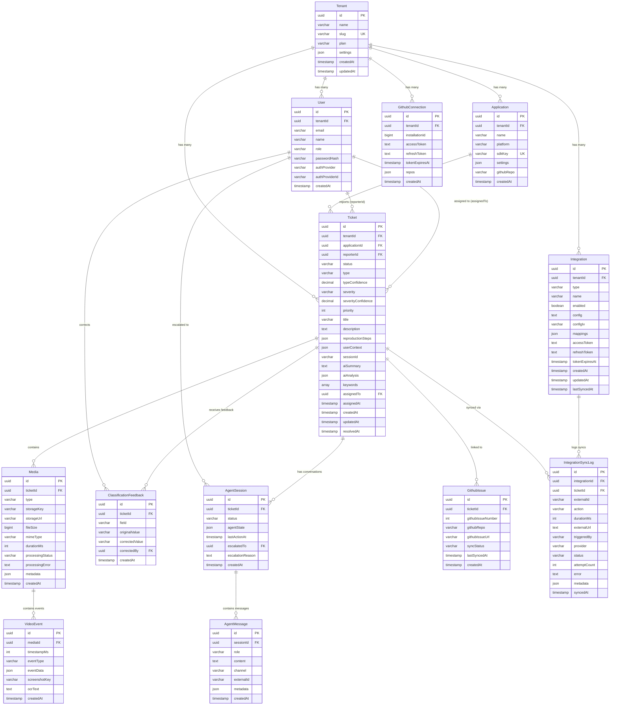

# Database Schema Documentation

## Overview

The Support Helper Platform uses **PostgreSQL** with **Prisma ORM** to manage a multi-tenant architecture for AI-powered technical support. The schema is designed around the **Tenant** model as the top-level isolation boundary, ensuring complete data segregation between organizations.

### Key Design Principles

1. **Multi-Tenancy**: All data is scoped to a `tenantId` - every query must filter by tenant
2. **AI-First**: Tickets include AI analysis fields for automated classification and summarization
3. **Extensibility**: JSON fields (`settings`, `metadata`, `aiAnalysis`) allow flexible storage
4. **Integration-Ready**: Built-in support for GitHub, Jira, HubSpot, Slack, and Notion
5. **Media Processing Pipeline**: Status tracking for async video analysis workflow

### PostgreSQL Extensions

- **uuid-ossp**: UUID generation for primary keys
- **pgvector**: Vector embeddings for AI/ML features (future use)

---

## Entity-Relationship Diagram



---

## Model Descriptions

### Core Multi-Tenant Models

#### Tenant
**Purpose**: Top-level organization/customer entity. All data is scoped to a tenant for complete isolation.

**Key Fields**:
- `slug`: URL-safe unique identifier for tenant routing
- `plan`: Subscription tier (free, pro, enterprise)
- `settings`: Flexible JSON for tenant-specific configuration

**Relationships**: Has many users, applications, tickets, GitHub connections, and integrations

---

#### User
**Purpose**: Dashboard users who manage tickets and configure the platform.

**Key Fields**:
- `email`: Unique per tenant (composite unique constraint with `tenantId`)
- `role`: Access control (admin, member, viewer)
- `authProvider`: OAuth provider (google, github) or null for email/password
- `passwordHash`: Bcrypt hash for email/password auth

**Relationships**:
- Reports tickets (as end users or testers)
- Receives ticket assignments
- Can be escalation target for AI agent sessions
- Provides classification feedback for ML training

---

#### Application
**Purpose**: Represents a client application (web app, mobile app) that submits tickets via SDK.

**Key Fields**:
- `sdkKey`: Unique API key for SDK authentication
- `platform`: Application type (web, ios, android, desktop)
- `githubRepo`: Linked GitHub repository for issue sync
- `settings`: SDK customization (widget appearance, auto-capture rules)

**Relationships**: Each application can submit many tickets

---

### Tickets & Reports

#### Ticket
**Purpose**: Core entity representing a bug report or support request with AI classification.

**Status Flow**: `new` → `triaged` → `in_progress` → `waiting` → `resolved` → `closed`

**Key Fields**:

**Classification** (AI-generated):
- `type`: bug, feature_request, question, feedback
- `typeConfidence`: 0.00-1.00 (Decimal precision for ML)
- `severity`: critical, high, medium, low
- `severityConfidence`: 0.00-1.00
- `priority`: Numeric priority (0-10)

**Content**:
- `title`: Auto-generated or user-provided summary
- `description`: Detailed problem description
- `reproductionSteps`: Structured JSON with step-by-step repro
- `userContext`: Browser, OS, viewport, custom metadata

**AI Analysis**:
- `aiSummary`: GPT-generated natural language summary
- `aiAnalysis`: Full JSON response from vision AI (frames, OCR, insights)
- `keywords`: Extracted searchable terms

**Assignment**:
- `assignedTo`: User ID of assignee
- `assignedAt`: Assignment timestamp

**Relationships**:
- Belongs to tenant and application
- Reported by user (optional - SDK can be anonymous)
- Assigned to user
- Contains media (videos, screenshots)
- Can be linked to GitHub issues
- Has AI agent conversation sessions
- Receives human feedback for ML training
- Synced to third-party integrations

**Indexes**: Optimized for common queries (tenant+status, tenant+assignedTo, application+createdAt)

---

### Media & Artifacts

#### Media
**Purpose**: Stores videos and screenshots attached to tickets, with processing status tracking.

**Processing Pipeline**: `pending` → `processing` → `completed` (or `failed`)

**Key Fields**:
- `type`: video, screenshot, screen_recording
- `storageKey`: S3/MinIO object key
- `storageUrl`: Pre-signed URL for access
- `fileSize`: Bytes for storage management
- `mimeType`: video/webm, image/png, etc.
- `durationMs`: Video length in milliseconds
- `processingStatus`: Async job status
- `processingError`: Error message if failed
- `metadata`: FFmpeg output, frame extraction info

**Relationships**: Belongs to ticket, contains video events

**Cascade Delete**: Media is deleted when parent ticket is deleted

---

#### VideoEvent
**Purpose**: Timestamped events extracted from video during AI analysis (keyframes, OCR results).

**Key Fields**:
- `timestampMs`: Position in video (0-based milliseconds)
- `eventType`: keyframe, click, navigation, error_detected
- `eventData`: Structured event payload (coordinates, element selectors)
- `screenshotKey`: S3 key for extracted frame image
- `ocrText`: Tesseract OCR output from frame

**Relationships**: Belongs to media

**Cascade Delete**: Events deleted with parent media

---

### GitHub Integration

#### GithubConnection
**Purpose**: OAuth connection between tenant and GitHub App installation.

**Key Fields**:
- `installationId`: GitHub App installation ID
- `accessToken`: Encrypted OAuth token
- `refreshToken`: Token refresh capability
- `tokenExpiresAt`: Expiration timestamp for token rotation
- `repos`: JSON array of connected repository names

**Relationships**: Belongs to tenant

---

#### GithubIssue
**Purpose**: Links Support Helper tickets to GitHub issues for bi-directional sync.

**Key Fields**:
- `githubIssueNumber`: Issue number in GitHub repository
- `githubRepo`: Repository full name (owner/repo)
- `githubIssueUrl`: Direct link to GitHub issue
- `syncStatus`: synced, pending, error
- `lastSyncedAt`: Last successful sync timestamp

**Relationships**: Linked to ticket (optional - can exist independently)

**Unique Constraint**: One record per GitHub repo/issue number

---

### Third-Party Integrations

#### Integration
**Purpose**: Configuration for third-party integrations (Jira, HubSpot, Slack, Notion).

**Key Fields**:
- `type`: jira, hubspot, slack, notion
- `name`: User-defined label
- `enabled`: Toggle for active/inactive
- `config`: **Encrypted** JSON (API keys, workspace IDs, project keys)
- `configIv`: Initialization vector for AES encryption
- `mappings`: Field mappings (e.g., severity→priority, status→state)
- `accessToken`: OAuth token (for HubSpot, Notion)
- `refreshToken`: Token refresh
- `tokenExpiresAt`: Token expiration

**Security**: All sensitive config is AES-256 encrypted using `INTEGRATION_ENCRYPTION_KEY`

**Relationships**: Belongs to tenant, has many sync logs

**Unique Constraint**: One integration per tenant+type+name

**Cascade Delete**: Integration deleted with tenant

---

#### IntegrationSyncLog
**Purpose**: Audit trail for ticket syncs to third-party systems.

**Key Fields**:
- `externalId`: Foreign system's ticket/issue ID
- `action`: create, update, comment, status_change
- `durationMs`: Sync operation duration
- `externalUrl`: Link to external ticket
- `triggeredBy`: manual, automatic, webhook
- `provider`: jira, hubspot, slack, notion
- `status`: success, failed, pending, retrying
- `attemptCount`: Retry tracking
- `error`: Error message on failure
- `metadata`: Full request/response payload

**Relationships**: Belongs to integration and ticket

**Cascade Delete**: Logs deleted with parent integration or ticket

**Indexes**: Optimized for filtering by status, action, integration

---

### AI Agent & Conversations

#### AgentSession
**Purpose**: Tracks AI agent conversation state for automated ticket triage and resolution.

**Key Fields**:
- `status`: active, resolved, escalated, timeout
- `agentState`: JSON state machine (current step, collected info, next actions)
- `lastActionAt`: Activity timestamp for timeout detection
- `escalatedTo`: User ID if escalated to human
- `escalationReason`: Why agent escalated (unclear_request, needs_access, etc.)

**Relationships**: Belongs to ticket, escalated to user, contains messages

---

#### AgentMessage
**Purpose**: Individual message in AI agent conversation (user input, agent response, system events).

**Key Fields**:
- `role`: user, assistant, system, function
- `content`: Message text
- `channel`: web, slack, email (for omnichannel support)
- `externalId`: Slack thread ID, email message ID, etc.
- `metadata`: Tool calls, function results, rich content

**Relationships**: Belongs to agent session

---

### Feedback & Learning

#### ClassificationFeedback
**Purpose**: Captures human corrections to AI classifications for continuous learning.

**Key Fields**:
- `field`: type, severity, priority, keywords
- `originalValue`: AI prediction
- `correctedValue`: Human-corrected value
- `correctedBy`: User who provided feedback

**Use Case**: Train/fine-tune classification models with ground truth data

**Relationships**: Belongs to ticket, corrected by user

---

## Enums & Constants

### Ticket Status
- `new`: Initial state
- `triaged`: Reviewed and classified
- `in_progress`: Actively being worked on
- `waiting`: Waiting for user response or external dependency
- `resolved`: Fixed/answered
- `closed`: Archived

### Ticket Type
- `bug`: Software defect
- `feature_request`: Enhancement request
- `question`: Support inquiry
- `feedback`: General feedback

### Ticket Severity
- `critical`: System down, data loss
- `high`: Major feature broken
- `medium`: Minor issue affecting some users
- `low`: Cosmetic or edge case

### Media Processing Status
- `pending`: Queued for processing
- `processing`: FFmpeg extraction in progress
- `completed`: Analysis done
- `failed`: Processing error

### User Roles
- `admin`: Full access including billing and settings
- `member`: Manage tickets and integrations
- `viewer`: Read-only access

### Tenant Plans
- `free`: Limited features
- `pro`: Full feature access
- `enterprise`: Custom SLA and support

### Integration Types
- `jira`: Atlassian Jira
- `hubspot`: HubSpot CRM
- `slack`: Slack workspace
- `notion`: Notion workspace

### Agent Session Status
- `active`: Ongoing conversation
- `resolved`: Successfully resolved
- `escalated`: Handed off to human
- `timeout`: No activity for threshold period

---

## Indexes & Performance

### Composite Indexes
Optimized for common query patterns:

**Tickets**:
- `(tenantId, status)` - Dashboard ticket filters
- `(tenantId, createdAt DESC)` - Recent tickets per tenant
- `(tenantId, assignedTo)` - My assigned tickets
- `(applicationId, createdAt DESC)` - Tickets per app

**Integrations**:
- `(tenantId, enabled)` - Active integrations lookup

**Media**:
- `(ticketId)` - Fetch all media for ticket
- `(processingStatus)` - Worker job queue

**VideoEvents**:
- `(mediaId, timestampMs)` - Timeline playback

### Unique Constraints
- `Tenant.slug` - URL routing
- `Application.sdkKey` - SDK authentication
- `(User.tenantId, User.email)` - One email per tenant
- `(GithubIssue.githubRepo, GithubIssue.githubIssueNumber)` - One record per GitHub issue
- `(Integration.tenantId, Integration.type, Integration.name)` - Named integrations per tenant

---

## Data Flow Examples

### Ticket Creation (SDK)
1. SDK captures video + metadata
2. Client requests pre-signed upload URL: `POST /api/media/upload-url`
3. Client uploads video directly to S3/MinIO
4. Client submits ticket: `POST /api/sdk/tickets/report` (multipart with video reference)
5. API creates `Ticket` + `Media` records (status=`pending`)
6. Worker picks up job → extracts keyframes → OCR → GPT-4 Vision
7. Worker updates `Ticket.aiSummary`, `Ticket.aiAnalysis`, `Media.processingStatus=completed`
8. Worker creates `VideoEvent` records for each keyframe

### GitHub Sync
1. User enables GitHub integration → OAuth flow → `GithubConnection` created
2. User creates ticket in Support Helper
3. User clicks "Create GitHub Issue" → API creates issue via GitHub API
4. API creates `GithubIssue` record linking ticket to issue
5. Webhook from GitHub → Worker updates ticket status based on issue state

### Integration Sync (Jira)
1. Admin configures Jira integration with project key + API token
2. `Integration` record created with **encrypted** config
3. User marks ticket for Jira sync
4. Worker calls Jira API to create issue
5. `IntegrationSyncLog` records action (status=`success`, externalId=JIRA-123)
6. Ticket updated with external link

---

## Security Considerations

### Encryption
- **Integration credentials**: AES-256-CBC encrypted using `INTEGRATION_ENCRYPTION_KEY`
- **OAuth tokens**: Encrypted at rest in database
- **User passwords**: Bcrypt hashed (never stored plaintext)

### Access Control
- **Tenant isolation**: All queries include `WHERE tenantId = ?`
- **Row-level security**: Users can only access data within their tenant
- **SDK authentication**: `x-sdk-key` header validates against `Application.sdkKey`
- **JWT authentication**: Dashboard users authenticated via JWT with tenant claims

### Cascade Deletes
- `Media` → `VideoEvent`: Deleting media removes all events
- `Integration` → `IntegrationSyncLog`: Deleting integration removes sync history
- `AgentSession` → `AgentMessage`: Deleting session removes all messages

---

## Migration History

Migrations located at: `apps/api/prisma/migrations/`

To view migration history:
```bash
pnpm db:migrate status
```

To create a new migration:
```bash
pnpm db:migrate dev --name descriptive_name
```

---

## Database Administration

### Tools
- **Prisma Studio**: `pnpm db:studio` - GUI for browsing data
- **psql**: Direct PostgreSQL client access
- **pgAdmin**: Full-featured PostgreSQL admin tool

### Backup Strategy
- Daily automated snapshots (production)
- Point-in-time recovery enabled
- Encrypted backups stored in S3

### Monitoring
- Slow query log enabled (> 1000ms)
- Connection pooling via PgBouncer
- Query performance tracked via Prisma metrics

---

## Future Enhancements

### Planned Features
- **Full-text search**: Integrate MeiliSearch index with ticket content
- **Vector embeddings**: Use `pgvector` for semantic search (similar tickets)
- **Audit log**: Track all mutations for compliance
- **Soft deletes**: Add `deletedAt` timestamps for recovery
- **Versioning**: Track ticket edit history

### Schema Evolution Guidelines
1. Never break backward compatibility in migrations
2. Add fields as nullable, then backfill, then make required
3. Use database views for complex reporting queries
4. Keep JSON fields for flexible extensions
5. Document all enum additions in this file

---

## References

- **Prisma Schema**: `apps/api/prisma/schema.prisma`
- **Seed Data**: `apps/api/prisma/seed.ts`
- **Zod Schemas**: `packages/database/src/schemas.ts`
- **Prisma Client**: Auto-generated at `node_modules/.prisma/client`
