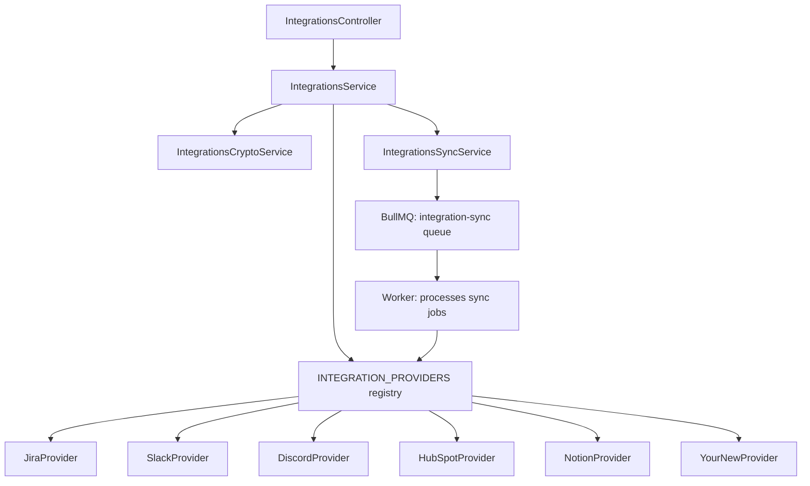
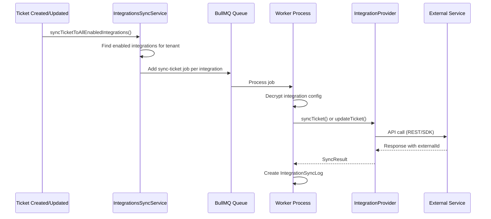

# Integration Provider Development Guide

This guide explains how integrations work in Support Helper and provides a step-by-step walkthrough for adding a new integration provider. After reading this document you should be able to create, register, test, and deploy a custom provider without referencing the existing source code.

---

## Table of Contents

1. [Overview](#1-overview)
2. [Architecture](#2-architecture)
3. [Provider Interface Contract](#3-provider-interface-contract)
4. [Step-by-Step: Add a New Provider](#4-step-by-step-add-a-new-provider)
5. [Example Provider Implementation](#5-example-provider-implementation)
6. [Configuration and Encryption](#6-configuration-and-encryption)
7. [Field Mappings](#7-field-mappings)
8. [Testing Guide](#8-testing-guide)
9. [Troubleshooting](#9-troubleshooting)

---

## 1. Overview

Support Helper integrations allow tickets to be pushed to (and optionally pulled from) external services such as Jira, Slack, Discord, HubSpot, and Notion. The system uses a **provider pattern** where each external service implements a common interface. When a ticket is created or updated, the platform can automatically sync it to every enabled integration for the tenant.

### Current Providers

| Provider | Type | Capabilities | Auth Method |
|----------|------|-------------|-------------|
| Jira | `jira` | Push, pull, update, delete | API token (Basic auth) |
| Slack | `slack` | Push, update, delete | Bot OAuth token |
| Discord | `discord` | Push, update, delete | Webhook URL |
| HubSpot | `hubspot` | Push, update, delete | Private app access token |
| Notion | `notion` | Push, update, delete | Integration secret |

### Key Concepts

- **Push sync**: Creating or updating a record in the external service when a ticket changes in Support Helper.
- **Pull sync**: Importing records from the external service into Support Helper as tickets.
- **Multi-tenant isolation**: All integrations are scoped to a tenant. A tenant may have multiple integrations of the same type (e.g., two Slack channels).
- **Encrypted configuration**: API keys and tokens are stored using AES-256-GCM encryption at rest.
- **Async processing**: Sync operations are queued via BullMQ and processed by the worker, not executed in the API request lifecycle.

---

## 2. Architecture

### Provider Pattern



### Sync Flow



### File Structure

```
apps/api/src/modules/integrations/
  providers/
    integration-provider.interface.ts   # Provider contract
    base-provider.abstract.ts           # Abstract base class with shared logic
    jira.provider.ts                    # Jira implementation
    slack.provider.ts                   # Slack implementation
    discord.provider.ts                 # Discord implementation
    hubspot.provider.ts                 # HubSpot implementation
    notion.provider.ts                  # Notion implementation
    index.ts                            # Provider registry (INTEGRATION_PROVIDERS)
  dto/
    create-integration.dto.ts           # Zod schema for creating integrations
    update-integration.dto.ts           # Zod schema for updating integrations
    index.ts
  types/
    integration.types.ts                # Shared TypeScript types
  integrations.controller.ts            # REST API endpoints
  integrations.service.ts               # Business logic (CRUD, encryption, validation)
  integrations-crypto.service.ts        # AES-256-GCM encryption/decryption
  integrations-sync.service.ts          # BullMQ job queuing
  integrations.module.ts                # NestJS module definition
  integrations.service.spec.ts          # Unit tests
```

### Database Schema

The integration system uses two database tables defined in `apps/api/prisma/schema.prisma`:

**`integrations` table (Integration model)**

| Column | Type | Description |
|--------|------|-------------|
| `id` | UUID | Primary key |
| `tenant_id` | UUID | Foreign key to Tenant (multi-tenant isolation) |
| `type` | VARCHAR(50) | Provider type key (e.g., `jira`, `slack`) |
| `name` | VARCHAR(255) | User-defined name for this integration instance |
| `enabled` | BOOLEAN | Whether sync is active |
| `config` | TEXT | AES-256-GCM encrypted JSON configuration |
| `config_iv` | VARCHAR(32) | Initialization vector for decryption |
| `mappings` | JSON | Optional field mappings (severity to priority, etc.) |
| `access_token` | TEXT | OAuth access token (if applicable) |
| `refresh_token` | TEXT | OAuth refresh token (if applicable) |
| `token_expires_at` | TIMESTAMP | OAuth token expiration |
| `last_synced_at` | TIMESTAMP | Last successful sync timestamp |
| `created_at` | TIMESTAMP | Record creation time |
| `updated_at` | TIMESTAMP | Record last update time |

Unique constraint: `(tenant_id, type, name)` -- a tenant cannot have two integrations with the same type and name.

**`integration_sync_logs` table (IntegrationSyncLog model)**

| Column | Type | Description |
|--------|------|-------------|
| `id` | UUID | Primary key |
| `integration_id` | UUID | Foreign key to Integration |
| `ticket_id` | UUID | Foreign key to Ticket |
| `external_id` | VARCHAR(500) | ID in the external system (e.g., Jira issue key) |
| `action` | VARCHAR(20) | `create`, `update`, or `delete` |
| `status` | VARCHAR(50) | `success`, `failed`, or `retrying` |
| `duration_ms` | INT | How long the sync took |
| `external_url` | TEXT | Link to the item in the external service |
| `triggered_by` | VARCHAR(20) | `auto` or `manual` |
| `provider` | VARCHAR(50) | Provider type key |
| `attempt_count` | INT | Number of retry attempts |
| `error` | TEXT | Error message if failed |
| `metadata` | JSON | Additional context |
| `synced_at` | TIMESTAMP | When the sync occurred |

---

## 3. Provider Interface Contract

Every provider must implement the `IntegrationProvider` interface defined in `providers/integration-provider.interface.ts`.

### Required Properties

```typescript
interface IntegrationProvider {
  /** Unique type key used in the registry and database (e.g., 'jira', 'trello') */
  readonly type: string;

  /** Human-readable display name (e.g., 'Jira', 'Trello') */
  readonly name: string;

  /** Short description shown in the UI (e.g., 'Sync tickets to Trello cards') */
  readonly description: string;

  /** Fields the user MUST provide to configure this integration */
  readonly requiredConfig: ConfigField[];

  /** Fields the user MAY provide for additional customization */
  readonly optionalConfig: ConfigField[];

  /** Whether this provider supports OAuth authorization flow */
  readonly supportsOAuth: boolean;

  /** Field mappings this provider supports between ticket and external fields */
  readonly supportedMappings: FieldMapping[];
}
```

### Required Methods

#### `validateConfig(config): Promise<{ valid: boolean; errors?: string[] }>`

Validates that the provided configuration contains all required fields and that values are well-formed. The base class (`BaseIntegrationProvider`) provides a default implementation that checks for presence of all `requiredConfig` keys. Override this to add custom validation (e.g., URL format checks, token prefix validation).

**Parameters:**
- `config: IntegrationConfig` -- Key-value record of configuration values.

**Returns:**
- `{ valid: true }` if the configuration is acceptable.
- `{ valid: false, errors: ['field X is required', ...] }` if validation fails.

#### `testConnection(config): Promise<{ success: boolean; message?: string; error?: string }>`

Makes a lightweight API call to the external service to verify that the credentials and configuration are valid. This is called when a user clicks "Test Connection" in the dashboard.

**Parameters:**
- `config: IntegrationConfig` -- Decrypted configuration.

**Returns:**
- `{ success: true, message: 'Connected as user@example.com' }` on success.
- `{ success: false, error: 'Invalid API token' }` on failure.

**Implementation guidance:**
- Use the least privileged API endpoint available (e.g., "get current user" or "list 1 item").
- Catch all errors and return a meaningful error message rather than throwing.
- Do not create, modify, or delete any data in the external service.

#### `syncTicket(ticket, config, mappings?): Promise<SyncResult>`

Creates a new item in the external service that corresponds to the given ticket.

**Parameters:**
- `ticket: Ticket` -- The Prisma Ticket model. Key fields: `id`, `title`, `description`, `status`, `severity`, `type`, `aiSummary`, `aiAnalysis`, `createdAt`.
- `config: IntegrationConfig` -- Decrypted configuration.
- `mappings?: Record<string, any>` -- Optional field mappings.

**Returns a `SyncResult`:**
```typescript
interface SyncResult {
  success: boolean;
  externalId?: string;   // ID in the external system (REQUIRED on success)
  externalUrl?: string;  // URL to view the item in the external system
  message?: string;      // Human-readable success message
  error?: string;        // Error message on failure
  metadata?: Record<string, any>;  // Additional context
}
```

**Implementation guidance:**
- Always return `externalId` on success -- this is stored in the sync log and used for subsequent updates.
- Include `externalUrl` when the external service provides a web link.
- Use `this.handleApiError(error, 'syncTicket')` from the base class for consistent error handling.
- Map ticket `severity` to the external service's priority system.
- Include AI analysis data (`aiSummary`, `aiAnalysis`) in the description/body when available.

#### `updateTicket(externalId, ticket, config, mappings?): Promise<SyncResult>`

Updates an existing item in the external service.

**Parameters:**
- `externalId: string` -- The ID returned from a previous `syncTicket` call.
- `ticket: Ticket` -- The updated ticket data.
- `config: IntegrationConfig` -- Decrypted configuration.
- `mappings?: Record<string, any>` -- Optional field mappings.

**Returns:** `SyncResult` (same as `syncTicket`).

### Optional Methods

#### `deleteTicket?(externalId, config): Promise<void>`

Removes or archives the item in the external service. Some providers (like Jira) may choose a no-op implementation if deletion is not desired. If not implemented, delete operations are silently skipped.

#### `pullTickets?(config, options?): Promise<PullResult>`

Imports tickets from the external service into Support Helper. Only implement this if two-way sync is meaningful for your provider (e.g., Jira, but not Slack).

**Parameters:**
- `config: IntegrationConfig` -- Decrypted configuration.
- `options?: { startAt?: number; maxResults?: number }` -- Pagination options.

**Returns:**
```typescript
interface PullResult {
  success: boolean;
  tickets: PulledTicket[];
  total: number;
  error?: string;
}

interface PulledTicket {
  externalId: string;
  externalUrl?: string;
  title: string;
  description?: string;
  status?: string;
  severity?: string;
  type?: string;
  createdAt?: string;
  updatedAt?: string;
  metadata?: Record<string, any>;
}
```

#### `getAuthorizationUrl?(state, config): string`

Returns the OAuth authorization URL for providers that use OAuth. The `state` parameter must be passed through to prevent CSRF.

#### `exchangeCodeForToken?(code, config): Promise<{ accessToken: string; refreshToken?: string; expiresAt?: Date }>`

Exchanges an OAuth authorization code for tokens.

#### `refreshAccessToken?(refreshToken, config): Promise<{ accessToken: string; expiresAt?: Date }>`

Refreshes an expired OAuth access token.

### Supporting Types

```typescript
interface ConfigField {
  key: string;                       // Config key name
  label: string;                     // Display label
  type: 'string' | 'password' | 'url' | 'select';  // Input type
  description?: string;              // Help text
  placeholder?: string;              // Placeholder text
  options?: { value: string; label: string }[];  // For 'select' type only
}

interface FieldMapping {
  sourceField: string;     // Ticket field name
  targetField: string;     // External service field name
  mappingType: 'direct' | 'transform';
  defaultValue?: any;
  transformFn?: string;
}

type IntegrationConfig = Record<string, any>;
```

---

## 4. Step-by-Step: Add a New Provider

This section walks through adding a hypothetical **Trello** integration provider.

### Step 1: Create the Provider File

Create a new file at:

```
apps/api/src/modules/integrations/providers/trello.provider.ts
```

```typescript
import { Ticket } from '@prisma/client';
import { BaseIntegrationProvider } from './base-provider.abstract';
import {
  IntegrationConfig,
  SyncResult,
  ConfigField,
} from '../types/integration.types';

export class TrelloProvider extends BaseIntegrationProvider {
  readonly type = 'trello';
  readonly name = 'Trello';
  readonly description = 'Sync tickets to Trello cards';

  readonly requiredConfig: ConfigField[] = [
    {
      key: 'apiKey',
      label: 'API Key',
      type: 'string',
      description: 'Trello API Key from https://trello.com/power-ups/admin',
      placeholder: 'Your Trello API key',
    },
    {
      key: 'token',
      label: 'Token',
      type: 'password',
      description: 'Trello API Token',
      placeholder: 'Your Trello token',
    },
    {
      key: 'boardId',
      label: 'Board ID',
      type: 'string',
      description: 'Trello board ID',
      placeholder: 'Board ID',
    },
    {
      key: 'listId',
      label: 'List ID',
      type: 'string',
      description: 'Trello list ID where cards will be created',
      placeholder: 'List ID',
    },
  ];

  readonly optionalConfig: ConfigField[] = [
    {
      key: 'labelColor',
      label: 'Label Color',
      type: 'select',
      description: 'Color for the Support Helper label',
      options: [
        { value: 'red', label: 'Red' },
        { value: 'orange', label: 'Orange' },
        { value: 'yellow', label: 'Yellow' },
        { value: 'green', label: 'Green' },
        { value: 'blue', label: 'Blue' },
        { value: 'purple', label: 'Purple' },
      ],
    },
  ];

  // ... implement required methods (see Section 5 for complete example)
}
```

### Step 2: Implement the Required Methods

At minimum you must implement:

1. `testConnection(config)` -- Make a lightweight API call to verify credentials.
2. `syncTicket(ticket, config, mappings?)` -- Create a new item in the external service.
3. `updateTicket(externalId, ticket, config, mappings?)` -- Update an existing item.

Optionally implement:

4. `deleteTicket(externalId, config)` -- Remove or archive an item.
5. `pullTickets(config, options?)` -- Import items from the external service.
6. Override `validateConfig(config)` -- Add custom validation beyond required field presence checks.

### Step 3: Register the Provider

Edit `apps/api/src/modules/integrations/providers/index.ts` to add your provider:

```typescript
import { SlackProvider } from './slack.provider';
import { DiscordProvider } from './discord.provider';
import { NotionProvider } from './notion.provider';
import { HubSpotProvider } from './hubspot.provider';
import { JiraProvider } from './jira.provider';
import { TrelloProvider } from './trello.provider';  // Add import

export const INTEGRATION_PROVIDERS = {
  slack: SlackProvider,
  discord: DiscordProvider,
  notion: NotionProvider,
  hubspot: HubSpotProvider,
  jira: JiraProvider,
  trello: TrelloProvider,  // Add to registry
} as const;

export type IntegrationType = keyof typeof INTEGRATION_PROVIDERS;

export {
  SlackProvider,
  DiscordProvider,
  NotionProvider,
  HubSpotProvider,
  JiraProvider,
  TrelloProvider,  // Add export
};
export { IntegrationProvider } from './integration-provider.interface';
export { BaseIntegrationProvider } from './base-provider.abstract';
```

That is the only registration step. The `IntegrationsService` dynamically looks up providers from the `INTEGRATION_PROVIDERS` map when creating or testing integrations. No module configuration or dependency injection changes are needed because providers are plain classes instantiated with `new Provider()`.

### Step 4: Install Dependencies (If Needed)

If your provider uses a third-party SDK, install it in the API package:

```bash
pnpm --filter @support-helper/api add trello-sdk
```

If the SDK is only used by the worker at sync time, consider installing it in both:

```bash
pnpm --filter @support-helper/api add trello-sdk
pnpm --filter @support-helper/worker add trello-sdk
```

Providers that use raw `fetch()` (like Jira, Discord, HubSpot) do not require additional dependencies. The global `fetch` API is available in Node.js 18+.

### Step 5: Write Tests

Create a test file at:

```
apps/api/src/modules/integrations/providers/trello.provider.spec.ts
```

See [Section 8: Testing Guide](#8-testing-guide) for complete test patterns.

### Step 6: Update Documentation

Add your provider to:

1. **This file** -- Update the "Current Providers" table in Section 1.
2. **`docs/API.md`** -- If you added new API endpoints.
3. **Dashboard UI** -- The provider will appear automatically via the `GET /api/integrations/types` endpoint, which reads `requiredConfig` and `optionalConfig` to render the configuration form.

---

## 5. Example Provider Implementation

Below is a complete, production-ready Trello provider implementation for reference.

```typescript
// apps/api/src/modules/integrations/providers/trello.provider.ts

import { Ticket } from '@prisma/client';
import { BaseIntegrationProvider } from './base-provider.abstract';
import {
  IntegrationConfig,
  SyncResult,
  PullResult,
  PulledTicket,
  ConfigField,
} from '../types/integration.types';

export class TrelloProvider extends BaseIntegrationProvider {
  readonly type = 'trello';
  readonly name = 'Trello';
  readonly description = 'Sync tickets to Trello cards';

  readonly requiredConfig: ConfigField[] = [
    {
      key: 'apiKey',
      label: 'API Key',
      type: 'string',
      description: 'Trello API Key from https://trello.com/power-ups/admin',
      placeholder: 'Your Trello API key',
    },
    {
      key: 'token',
      label: 'Token',
      type: 'password',
      description: 'Trello API Token',
      placeholder: 'Your Trello token',
    },
    {
      key: 'boardId',
      label: 'Board ID',
      type: 'string',
      description: 'Trello board ID',
      placeholder: 'Board ID',
    },
    {
      key: 'listId',
      label: 'List ID',
      type: 'string',
      description: 'Trello list ID where cards will be created',
      placeholder: 'List ID',
    },
  ];

  readonly optionalConfig: ConfigField[] = [
    {
      key: 'labelColor',
      label: 'Label Color',
      type: 'select',
      description: 'Color for the Support Helper label',
      options: [
        { value: 'red', label: 'Red' },
        { value: 'orange', label: 'Orange' },
        { value: 'yellow', label: 'Yellow' },
        { value: 'green', label: 'Green' },
        { value: 'blue', label: 'Blue' },
        { value: 'purple', label: 'Purple' },
      ],
    },
  ];

  private readonly baseUrl = 'https://api.trello.com/1';

  private getAuthParams(config: IntegrationConfig): string {
    return `key=${config.apiKey}&token=${config.token}`;
  }

  async testConnection(
    config: IntegrationConfig,
  ): Promise<{ success: boolean; message?: string; error?: string }> {
    try {
      const response = await fetch(
        `${this.baseUrl}/members/me?${this.getAuthParams(config)}`,
        { method: 'GET', headers: { Accept: 'application/json' } },
      );

      if (!response.ok) {
        const errorText = await response.text();
        throw new Error(`Trello API error: ${response.status} - ${errorText}`);
      }

      const user = (await response.json()) as { fullName?: string; username?: string };

      return {
        success: true,
        message: `Connected as ${user.fullName || user.username}`,
      };
    } catch (error: any) {
      return {
        success: false,
        error: error.message || 'Failed to connect to Trello',
      };
    }
  }

  async syncTicket(
    ticket: Ticket,
    config: IntegrationConfig,
    _mappings?: Record<string, any>,
  ): Promise<SyncResult> {
    try {
      const descriptionParts: string[] = [];

      if (ticket.description) {
        descriptionParts.push(ticket.description);
      }
      if (ticket.aiSummary) {
        descriptionParts.push(`\n--- AI Summary ---\n${ticket.aiSummary}`);
      }

      descriptionParts.push(`\n--- Ticket Info ---`);
      descriptionParts.push(`Ticket ID: ${ticket.id}`);
      descriptionParts.push(`Status: ${ticket.status || 'new'}`);
      descriptionParts.push(`Severity: ${ticket.severity || 'unknown'}`);
      descriptionParts.push(`Type: ${ticket.type || 'unknown'}`);

      const response = await fetch(
        `${this.baseUrl}/cards?${this.getAuthParams(config)}`,
        {
          method: 'POST',
          headers: {
            'Content-Type': 'application/json',
            Accept: 'application/json',
          },
          body: JSON.stringify({
            idList: config.listId,
            name: ticket.title || 'Untitled Ticket',
            desc: descriptionParts.join('\n'),
          }),
        },
      );

      if (!response.ok) {
        const errorText = await response.text();
        throw new Error(`Trello API error: ${response.status} - ${errorText}`);
      }

      const card = (await response.json()) as { id: string; shortUrl: string };

      return {
        success: true,
        externalId: card.id,
        externalUrl: card.shortUrl,
        message: 'Card created in Trello',
      };
    } catch (error) {
      return this.handleApiError(error, 'syncTicket');
    }
  }

  async updateTicket(
    externalId: string,
    ticket: Ticket,
    config: IntegrationConfig,
    _mappings?: Record<string, any>,
  ): Promise<SyncResult> {
    try {
      const descriptionParts: string[] = [];

      if (ticket.description) {
        descriptionParts.push(ticket.description);
      }
      if (ticket.aiSummary) {
        descriptionParts.push(`\n--- AI Summary ---\n${ticket.aiSummary}`);
      }

      descriptionParts.push(`\n--- Ticket Info ---`);
      descriptionParts.push(`Ticket ID: ${ticket.id}`);
      descriptionParts.push(`Status: ${ticket.status || 'new'}`);
      descriptionParts.push(`Severity: ${ticket.severity || 'unknown'}`);
      descriptionParts.push(`Type: ${ticket.type || 'unknown'}`);

      const response = await fetch(
        `${this.baseUrl}/cards/${externalId}?${this.getAuthParams(config)}`,
        {
          method: 'PUT',
          headers: {
            'Content-Type': 'application/json',
            Accept: 'application/json',
          },
          body: JSON.stringify({
            name: ticket.title || 'Untitled Ticket',
            desc: descriptionParts.join('\n'),
          }),
        },
      );

      if (!response.ok) {
        const errorText = await response.text();
        throw new Error(`Trello API error: ${response.status} - ${errorText}`);
      }

      const card = (await response.json()) as { id: string; shortUrl: string };

      return {
        success: true,
        externalId: card.id,
        externalUrl: card.shortUrl,
        message: 'Card updated in Trello',
      };
    } catch (error) {
      return this.handleApiError(error, 'updateTicket');
    }
  }

  async deleteTicket(
    externalId: string,
    config: IntegrationConfig,
  ): Promise<void> {
    // Archive the card instead of permanently deleting it
    const response = await fetch(
      `${this.baseUrl}/cards/${externalId}?${this.getAuthParams(config)}`,
      {
        method: 'PUT',
        headers: { 'Content-Type': 'application/json' },
        body: JSON.stringify({ closed: true }),
      },
    );

    if (!response.ok && response.status !== 404) {
      const errorText = await response.text();
      throw new Error(`Trello API error: ${response.status} - ${errorText}`);
    }
  }

  async pullTickets(
    config: IntegrationConfig,
    options?: { startAt?: number; maxResults?: number },
  ): Promise<PullResult> {
    try {
      const response = await fetch(
        `${this.baseUrl}/boards/${config.boardId}/cards?${this.getAuthParams(config)}&fields=name,desc,closed,dateLastActivity,shortUrl`,
        { method: 'GET', headers: { Accept: 'application/json' } },
      );

      if (!response.ok) {
        const errorText = await response.text();
        throw new Error(`Trello API error: ${response.status} - ${errorText}`);
      }

      const cards = (await response.json()) as Array<{
        id: string;
        name: string;
        desc: string;
        closed: boolean;
        dateLastActivity: string;
        shortUrl: string;
      }>;

      const openCards = cards.filter((c) => !c.closed);
      const tickets: PulledTicket[] = openCards.map((card) => ({
        externalId: card.id,
        externalUrl: card.shortUrl,
        title: card.name,
        description: card.desc,
        updatedAt: card.dateLastActivity,
      }));

      return { success: true, tickets, total: tickets.length };
    } catch (error: any) {
      return {
        success: false,
        tickets: [],
        total: 0,
        error: error.message,
      };
    }
  }
}
```

---

## 6. Configuration and Encryption

### How Configuration is Stored

When a user creates an integration through the dashboard, the API:

1. **Validates** the configuration using the provider's `validateConfig()` method.
2. **Encrypts** the entire config JSON using AES-256-GCM via `IntegrationsCryptoService`.
3. **Stores** the ciphertext in the `config` column and the initialization vector in the `config_iv` column.

When the configuration is needed (for syncing or displaying), the service:

1. **Reads** the encrypted `config` and `configIv` from the database.
2. **Decrypts** using `IntegrationsCryptoService.decrypt(ciphertext, iv)`.
3. **Parses** the JSON string back into an `IntegrationConfig` object.

### Encryption Implementation

The crypto service (`integrations-crypto.service.ts`) uses functions from the `@support-helper/shared` package:

```typescript
@Injectable()
export class IntegrationsCryptoService {
  private readonly key: Buffer;

  constructor(private config: ConfigService) {
    const keyString = this.config.get<string>('INTEGRATION_ENCRYPTION_KEY');
    if (!keyString) {
      throw new Error('INTEGRATION_ENCRYPTION_KEY not configured');
    }
    this.key = parseEncryptionKey(keyString);
  }

  encrypt(plaintext: string): { ciphertext: string; iv: string } {
    return encryptAES256GCM(plaintext, this.key);
  }

  decrypt(ciphertext: string, ivHex: string): string {
    return decryptAES256GCM(ciphertext, ivHex, this.key);
  }
}
```

### Environment Variables

| Variable | Required | Description |
|----------|----------|-------------|
| `INTEGRATION_ENCRYPTION_KEY` | Yes | 32-byte hex key for AES-256-GCM. Generate with: `openssl rand -hex 32` |

If this variable is not set, the `IntegrationsCryptoService` will throw on startup and integrations will not function.

### Security Considerations

- **Never log decrypted configuration.** The base class logs operations but not config values.
- **Never return raw config in API responses.** The `IntegrationsService.decryptIntegration()` method strips the `configIv` field before returning.
- **Sensitive fields** should use `type: 'password'` in `ConfigField` so the dashboard UI masks them.
- **Config rotation**: If the encryption key changes, all existing integrations will fail to decrypt. There is no built-in key rotation mechanism; you would need to decrypt all configs with the old key and re-encrypt with the new one.

---

## 7. Field Mappings

Field mappings allow users to customize how ticket fields map to fields in the external service. Each provider can define `supportedMappings` to declare which mappings it supports.

### Severity-to-Priority Mapping

Most external services have a "priority" concept that maps to Support Helper's "severity" field. Here is how the existing providers handle this:

**Jira:**

| Severity | Jira Priority |
|----------|---------------|
| critical | Highest |
| high | High |
| medium | Medium |
| low | Low |

The Jira provider also supports custom mappings via the `priorityMapping` optional config field (a JSON string).

**HubSpot:**

| Severity | HubSpot Priority |
|----------|-----------------|
| critical | HIGH |
| high | HIGH |
| medium | MEDIUM |
| low | LOW |

**Discord:**

Discord uses color-coded embeds instead of priority fields:

| Severity | Embed Color |
|----------|-------------|
| critical | `0xFF0000` (red) |
| high | `0xFF6600` (orange) |
| medium | `0xFFCC00` (yellow) |
| low | `0x00CCFF` (light blue) |
| default | `0x999999` (gray) |

### Using the `applyMappings` Helper

The `BaseIntegrationProvider` provides a protected `applyMappings(ticket, mappings)` method that converts ticket fields to target fields based on a mapping object:

```typescript
// In your provider:
const additionalMappings = this.applyMappings(ticket, mappings);
// additionalMappings is a Record<string, any> with target field names as keys
```

The `mappings` parameter is a `Record<string, any>` where keys are ticket field names (source) and values are external field names (target). The method reads the value from the ticket and places it under the target key.

### Implementing Custom Mappings in Your Provider

```typescript
// Example: Mapping severity to a custom "urgency" field in your external service
private mapSeverityToUrgency(severity: string | null): string {
  switch (severity?.toLowerCase()) {
    case 'critical': return 'P1';
    case 'high':     return 'P2';
    case 'medium':   return 'P3';
    case 'low':      return 'P4';
    default:         return 'P3';
  }
}
```

---

## 8. Testing Guide

All integration tests use **Jest** (the API package test framework). Test files follow the `*.spec.ts` naming convention.

### Unit Test Pattern for a Provider

```typescript
// apps/api/src/modules/integrations/providers/trello.provider.spec.ts

import { TrelloProvider } from './trello.provider';

// Mock global fetch
const mockFetch = jest.fn();
global.fetch = mockFetch;

describe('TrelloProvider', () => {
  let provider: TrelloProvider;

  const validConfig = {
    apiKey: 'test-api-key',
    token: 'test-token',
    boardId: 'board-123',
    listId: 'list-456',
  };

  const mockTicket = {
    id: 'ticket-uuid-123',
    title: 'Login button broken',
    description: 'The login button does not respond to clicks.',
    status: 'new',
    severity: 'high',
    type: 'bug',
    aiSummary: 'User reports unresponsive login button.',
    aiAnalysis: null,
    createdAt: new Date('2026-01-01'),
    updatedAt: new Date('2026-01-01'),
    tenantId: 'tenant-123',
    applicationId: 'app-123',
  } as any;

  beforeEach(() => {
    provider = new TrelloProvider();
    jest.clearAllMocks();
  });

  describe('metadata', () => {
    it('should have correct type and name', () => {
      expect(provider.type).toBe('trello');
      expect(provider.name).toBe('Trello');
    });

    it('should define required config fields', () => {
      const keys = provider.requiredConfig.map((f) => f.key);
      expect(keys).toContain('apiKey');
      expect(keys).toContain('token');
      expect(keys).toContain('boardId');
      expect(keys).toContain('listId');
    });
  });

  describe('validateConfig', () => {
    it('should pass with all required fields', async () => {
      const result = await provider.validateConfig(validConfig);
      expect(result.valid).toBe(true);
    });

    it('should fail when required fields are missing', async () => {
      const result = await provider.validateConfig({ apiKey: 'key' });
      expect(result.valid).toBe(false);
      expect(result.errors).toBeDefined();
      expect(result.errors!.length).toBeGreaterThan(0);
    });
  });

  describe('testConnection', () => {
    it('should return success when API responds OK', async () => {
      mockFetch.mockResolvedValueOnce({
        ok: true,
        json: async () => ({ fullName: 'Test User', username: 'testuser' }),
      });

      const result = await provider.testConnection(validConfig);

      expect(result.success).toBe(true);
      expect(result.message).toContain('Test User');
      expect(mockFetch).toHaveBeenCalledWith(
        expect.stringContaining('/members/me'),
        expect.any(Object),
      );
    });

    it('should return failure on API error', async () => {
      mockFetch.mockResolvedValueOnce({
        ok: false,
        status: 401,
        text: async () => 'Unauthorized',
      });

      const result = await provider.testConnection(validConfig);

      expect(result.success).toBe(false);
      expect(result.error).toBeDefined();
    });

    it('should handle network errors', async () => {
      mockFetch.mockRejectedValueOnce(new Error('Network error'));

      const result = await provider.testConnection(validConfig);

      expect(result.success).toBe(false);
      expect(result.error).toContain('Network error');
    });
  });

  describe('syncTicket', () => {
    it('should create a card and return externalId', async () => {
      mockFetch.mockResolvedValueOnce({
        ok: true,
        json: async () => ({ id: 'card-789', shortUrl: 'https://trello.com/c/abc123' }),
      });

      const result = await provider.syncTicket(mockTicket, validConfig);

      expect(result.success).toBe(true);
      expect(result.externalId).toBe('card-789');
      expect(result.externalUrl).toBe('https://trello.com/c/abc123');
    });

    it('should include ticket info in card description', async () => {
      mockFetch.mockResolvedValueOnce({
        ok: true,
        json: async () => ({ id: 'card-789', shortUrl: 'https://trello.com/c/abc' }),
      });

      await provider.syncTicket(mockTicket, validConfig);

      const body = JSON.parse(mockFetch.mock.calls[0][1].body);
      expect(body.name).toBe('Login button broken');
      expect(body.desc).toContain('Ticket ID:');
      expect(body.desc).toContain('high');
    });

    it('should return error on API failure', async () => {
      mockFetch.mockResolvedValueOnce({
        ok: false,
        status: 400,
        text: async () => 'Bad Request',
      });

      const result = await provider.syncTicket(mockTicket, validConfig);

      expect(result.success).toBe(false);
      expect(result.error).toBeDefined();
    });
  });

  describe('updateTicket', () => {
    it('should update the card', async () => {
      mockFetch.mockResolvedValueOnce({
        ok: true,
        json: async () => ({ id: 'card-789', shortUrl: 'https://trello.com/c/abc' }),
      });

      const result = await provider.updateTicket('card-789', mockTicket, validConfig);

      expect(result.success).toBe(true);
      expect(result.externalId).toBe('card-789');
      expect(mockFetch).toHaveBeenCalledWith(
        expect.stringContaining('/cards/card-789'),
        expect.objectContaining({ method: 'PUT' }),
      );
    });
  });
});
```

### Integration Test Pattern (IntegrationsService)

The existing test at `integrations.service.spec.ts` demonstrates how to test the service layer with mocked Prisma and crypto services:

```typescript
// Key patterns from the existing test:

const mockPrisma = {
  integration: {
    create: jest.fn(),
    findMany: jest.fn(),
    findFirst: jest.fn(),
    findUnique: jest.fn(),
    update: jest.fn(),
    delete: jest.fn(),
  },
  integrationSyncLog: {
    findMany: jest.fn(),
    count: jest.fn(),
  },
};

const mockCrypto = {
  encrypt: jest.fn(),
  decrypt: jest.fn(),
};

// Test module setup:
const module = await Test.createTestingModule({
  providers: [
    IntegrationsService,
    { provide: PrismaService, useValue: mockPrisma },
    { provide: IntegrationsCryptoService, useValue: mockCrypto },
  ],
}).compile();
```

### What to Test

| Area | What to Verify |
|------|---------------|
| **Metadata** | `type`, `name`, `description` are set correctly |
| **Config validation** | Passes with valid config; fails with missing required fields |
| **testConnection** | Returns `success: true` on good credentials; returns `success: false` (not throw) on bad credentials; handles network errors |
| **syncTicket** | Returns `SyncResult` with `externalId`; includes ticket data in the payload; handles API errors |
| **updateTicket** | Calls the correct endpoint with the `externalId`; returns updated `SyncResult` |
| **deleteTicket** | Calls the correct endpoint; handles 404 gracefully |
| **pullTickets** | Parses response into `PulledTicket[]`; handles pagination; handles errors |
| **Tenant isolation** | Queries always include `tenantId` filter |

### Running Tests

```bash
# Run all API tests
pnpm --filter @support-helper/api test

# Run only integration provider tests
pnpm --filter @support-helper/api test -- --testPathPattern="providers"

# Run a specific test file
pnpm --filter @support-helper/api test -- trello.provider.spec.ts

# Run with coverage
pnpm --filter @support-helper/api test -- --coverage
```

---

## 9. Troubleshooting

### Common Issues

#### "Unknown integration type: xyz"

**Cause:** The provider type key is not registered in `INTEGRATION_PROVIDERS` in `providers/index.ts`.

**Fix:** Add your provider to the registry map and export it. The `type` property on your provider class must exactly match the key in the registry.

#### "INTEGRATION_ENCRYPTION_KEY not configured"

**Cause:** The `INTEGRATION_ENCRYPTION_KEY` environment variable is not set.

**Fix:** Generate a key and add it to `.env.local`:

```bash
# Generate a 32-byte hex key
openssl rand -hex 32

# Add to .env.local
INTEGRATION_ENCRYPTION_KEY=<generated-key>
```

#### "Integration has corrupted credentials. Please reconfigure."

**Cause:** The encryption key changed or the stored ciphertext is corrupted.

**Fix:** The user must delete and re-create the integration with fresh credentials. If the encryption key was rotated, all integrations need to be re-created.

#### OAuth Token Expiration

**Cause:** The `accessToken` stored on the integration record has expired.

**Fix:** If your provider implements `refreshAccessToken()`, the system can attempt automatic renewal. Otherwise, the user must re-authorize through the OAuth flow. Check the `token_expires_at` field to diagnose.

#### Rate Limiting

**Cause:** The external service is rejecting requests due to too many API calls.

**Symptoms:** `SyncResult` with `success: false` and an error mentioning 429 status or "rate limit".

**Fix:**
- BullMQ jobs use priority-based processing. Consider using higher priority numbers (lower urgency) for bulk syncs.
- Implement backoff in your provider: check the response headers for `Retry-After` and throw a retriable error.
- Check the external service's rate limit documentation and adjust sync frequency.

#### Webhook Delivery Failures (Discord, Slack)

**Cause:** The webhook URL is invalid, the channel was deleted, or the bot was removed.

**Fix:**
1. Run `POST /api/integrations/:id/test` to verify the connection.
2. Check the sync logs via `GET /api/integrations/:id/logs?status=failed`.
3. Have the user regenerate the webhook URL or re-invite the bot.

#### Sync Jobs Not Processing

**Cause:** The worker is not running or the BullMQ `integration-sync` queue is backed up.

**Fix:**
1. Verify the worker process is running: `pnpm --filter @support-helper/worker dev`
2. Check Redis connectivity: the `REDIS_URL` env var must be set.
3. Inspect the queue via BullMQ dashboard or Redis CLI.

#### Duplicate Items Created in External Service

**Cause:** A sync job was processed multiple times (e.g., due to a crash and retry) without deduplication.

**Fix:** The `IntegrationsSyncService` checks for existing sync logs with `externalId` before deciding between `create` and `update` actions. If duplicate creation still occurs:
1. Check `integration_sync_logs` for multiple `create` entries for the same ticket and integration.
2. The `POST /api/integrations/:id/sync` endpoint performs smart deduplication -- it skips tickets that already have a successful sync log with an `externalId`.

### Debugging Tips

1. **Check sync logs first**: `GET /api/integrations/:id/logs` shows the history of all sync attempts with errors and durations.
2. **Check sync stats**: `GET /api/integrations/:id/stats` shows success rate and recent activity.
3. **Test connection in isolation**: `POST /api/integrations/:id/test` calls `testConnection()` without affecting any data.
4. **Enable verbose logging**: Set `LOG_LEVEL=debug` to see detailed provider-level logs from the `Logger` instance.
5. **Inspect raw payloads**: Add temporary `this.logger.debug()` calls in your provider during development (remove before committing).

### API Endpoints Reference

All endpoints require `Authorization: Bearer <jwt-token>` and are scoped to the authenticated user's tenant.

| Method | Path | Description |
|--------|------|-------------|
| `POST` | `/api/integrations` | Create a new integration |
| `GET` | `/api/integrations` | List all integrations (optional filters: `?type=`, `?enabled=`) |
| `GET` | `/api/integrations/types` | List available integration types with config schemas |
| `GET` | `/api/integrations/:id` | Get integration details (decrypted config) |
| `PATCH` | `/api/integrations/:id` | Update an integration |
| `DELETE` | `/api/integrations/:id` | Delete an integration |
| `POST` | `/api/integrations/:id/test` | Test connection to the external service |
| `POST` | `/api/integrations/:id/sync` | Trigger manual sync (push, pull, or both) |
| `GET` | `/api/integrations/:id/logs` | Get sync logs (with filters and pagination) |
| `GET` | `/api/integrations/:id/stats` | Get sync statistics |
