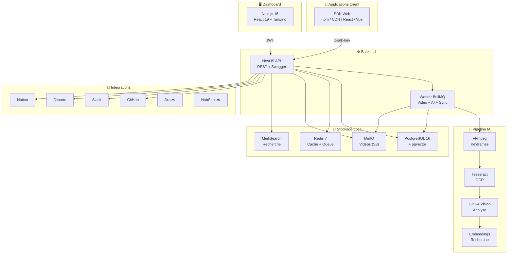

# Support Helper Platform

> **Plateforme de support technique autonome, propulsée par l'IA, hébergée en local.**
> Reporter des bugs en vidéo. Analyser automatiquement. Résoudre avec des agents IA. Du ticket au déploiement.

---

## Table des matières

- [Concept](#concept)
- [Le Problème](#le-problème)
- [La Solution](#la-solution)
- [Comment ça marche](#comment-ça-marche)
- [Architecture technique](#architecture-technique)
- [Stack technique](#stack-technique)
- [Fonctionnalités — Ce qui est fait](#fonctionnalités--ce-qui-est-fait)
- [Fonctionnalités — Ce qui reste à faire](#fonctionnalités--ce-qui-reste-à-faire)
- [Roadmap visuelle](#roadmap-visuelle)
- [Self-hosted : Pourquoi tout est en local](#self-hosted--pourquoi-tout-est-en-local)
- [Modèle économique](#modèle-économique)

---

## Concept

Support Helper est une plateforme complète qui couvre **tout le cycle de vie du support technique** — du bug reporté par l'utilisateur final jusqu'au correctif déployé en production.

```
  Utilisateur       →  SDK (vidéo)  →  IA (analyse)  →  Ticket  →  Agent IA  →  Code Fix  →  Déployé
  reporte un bug       capture          classifie        créé       résout       généré       en prod
```

**En une phrase** : Un utilisateur clique sur un bouton, filme son bug, et l'IA s'occupe du reste — analyse, classification, création de ticket, proposition de solution, écriture du code, review de PR, et déploiement.

---

## Le Problème

Le support technique est un gouffre de temps et d'argent :

| Problème | Impact |
|----------|--------|
| Les utilisateurs décrivent mal les bugs | Les devs passent des heures à reproduire |
| Le triage est manuel et incohérent | Les tickets critiques sont noyés |
| Pas de lien entre ticket et code | Le context est perdu entre support et dev |
| Le support L1/L2 est répétitif | 70% des tickets ont déjà une solution connue |
| Les outils sont fragmentés | Jira ici, Slack là, GitHub ailleurs, rien ne communique |
| Données dans le cloud | L'entreprise n'a pas le contrôle de ses données |

---

## La Solution

### 1. SDK — Capture vidéo du bug

Un SDK léger (`<50KB`) que le client installe dans son app. L'utilisateur clique sur un bouton, enregistre son écran, et soumet son rapport. Le SDK capture automatiquement :

- **Vidéo** de l'écran (MediaRecorder API)
- **Contexte système** : OS, navigateur, résolution, timezone
- **URL et état** de l'application au moment du bug
- **Logs console** et erreurs JavaScript

### 2. IA — Analyse automatique

La vidéo est envoyée à un pipeline IA qui :

- **Extrait les keyframes** (FFmpeg)
- **Fait de l'OCR** sur chaque frame (Tesseract)
- **Analyse avec GPT-4 Vision** pour comprendre le bug
- **Classifie** : type (UI, crash, perf...), sévérité (critique, haute, moyenne, basse)
- **Génère** : résumé, étapes de reproduction, mots-clés
- **Crée les embeddings** pour la recherche sémantique (tickets similaires)

### 3. Intégrations — Connexion aux outils existants

Support Helper se connecte aux outils de ticketing que l'entreprise utilise déjà :

- **GitHub** → Création automatique d'issues, synchronisation bidirectionnelle
- **Slack** → Notifications enrichies avec Block Kit
- **Discord** → Notifications via webhooks
- **Notion** → Création de pages dans une base de données
- **Jira** → Synchronisation de tickets *(à venir)*
- **HubSpot** → Intégration CRM *(à venir)*
- **Linear** → Gestion de projets *(à venir)*

### 4. Agents IA — Support autonome L1/L2/L3

Des agents IA autonomes gèrent le support à différents niveaux :

| Niveau | Agent | Ce qu'il fait |
|--------|-------|---------------|
| **L1** | Triage & Résolution rapide | Recherche de tickets similaires déjà résolus, propose une solution immédiate, répond au reporter |
| **L2** | Investigation technique | Analyse le code lié, identifie la cause racine, propose un fix, crée une US |
| **L3** | Code & Déploiement | Écrit le code correctif, crée une PR, demande une review, lance le déploiement |

### 5. Du ticket au déploiement

Si l'entreprise connecte son repo GitHub :

```
Ticket créé
    │
    ▼
Agent analyse le ticket + le code source
    │
    ▼
Création d'une User Story (issue GitHub)
    │
    ▼
Agent écrit le fix (branche + commits)
    │
    ▼
Pull Request créée automatiquement
    │
    ▼
Review automatique (ou humaine si escalade)
    │
    ▼
Merge + Déploiement
    │
    ▼
Ticket fermé, reporter notifié
```

### 6. Tout en local — Zero cloud

**Aucune donnée ne quitte l'infrastructure de l'entreprise.** Tout tourne en Docker sur les serveurs du client :

- Base de données PostgreSQL locale
- Stockage vidéo MinIO (S3-compatible) local
- Cache Redis local
- Recherche MeiliSearch locale
- Les seuls appels externes sont vers l'API OpenAI (et même ça peut être remplacé par un modèle local)

---

## Comment ça marche

```
┌──────────────────────────────────────────────────────────────────────────────┐
│                                                                              │
│   👤 UTILISATEUR              📦 SDK                    🖥️ APP CLIENT        │
│   ─────────────              ─────                    ──────────           │
│   Clique "Report"  ──▶  Enregistre la vidéo  ──▶  Capture le contexte     │
│                          + logs + erreurs         OS, browser, URL         │
│                                                                              │
└──────────────────────────────────┬───────────────────────────────────────────┘
                                   │
                                   ▼ Upload vidéo + metadata
┌──────────────────────────────────────────────────────────────────────────────┐
│                                                                              │
│   🔧 API (NestJS)                                                           │
│   ──────────────                                                            │
│   • Authentifie (SDK key)                                                    │
│   • Crée le ticket                                                          │
│   • Upload vidéo vers MinIO (pre-signed URL)                                │
│   • Met en queue le job d'analyse                                           │
│                                                                              │
└──────────────────────────────────┬───────────────────────────────────────────┘
                                   │
                                   ▼ Job BullMQ
┌──────────────────────────────────────────────────────────────────────────────┐
│                                                                              │
│   🤖 WORKER (Pipeline IA)                                                   │
│   ─────────────────────                                                     │
│   1. Télécharge la vidéo depuis MinIO                                       │
│   2. Extrait les keyframes (FFmpeg)                                         │
│   3. OCR sur chaque frame (Tesseract)                                       │
│   4. Analyse GPT-4 Vision → résumé + classification + sévérité             │
│   5. Génère les embeddings (text-embedding-3-large)                         │
│   6. Indexe dans MeiliSearch                                                │
│   7. Met à jour le ticket en DB                                             │
│                                                                              │
└──────────────────────────────────┬───────────────────────────────────────────┘
                                   │
                                   ▼
┌──────────────────────────────────────────────────────────────────────────────┐
│                                                                              │
│   🤖 AGENT IA (Support autonome)                                            │
│   ──────────────────────────────                                            │
│   • Analyse le ticket enrichi par l'IA                                      │
│   • Cherche des tickets similaires (pgvector)                               │
│   • Propose une solution ou escalade                                        │
│   • State machine : ANALYZING → PROPOSING → RESOLVED / ESCALATED           │
│   • Si repo GitHub connecté → crée issue, écrit le fix, ouvre une PR        │
│                                                                              │
└──────────────────────────────────┬───────────────────────────────────────────┘
                                   │
                                   ▼
┌──────────────────────────────────────────────────────────────────────────────┐
│                                                                              │
│   📊 DASHBOARD (Next.js)                                                    │
│   ──────────────────────                                                    │
│   • Liste des tickets avec lecture vidéo                                    │
│   • Analytics : tendances, performance, stats agents                        │
│   • Gestion des intégrations (Slack, Discord, Notion...)                    │
│   • Gestion des applications et SDK keys                                    │
│   • Settings entreprise                                                     │
│                                                                              │
└──────────────────────────────────────────────────────────────────────────────┘
```

---

## Architecture technique



---

## Stack technique

| Couche | Technologie | Rôle |
|--------|-------------|------|
| **SDK** | TypeScript, Vite, Web Components | Widget `<support-helper>` + wrappers React/Vue |
| **API** | NestJS 10, Prisma 5, TypeScript | REST API, auth JWT/SDK key, multi-tenant |
| **Dashboard** | Next.js 15, React 19, TailwindCSS, TanStack Query | Interface de gestion |
| **Worker** | NestJS, BullMQ, FFmpeg, Tesseract | Traitement vidéo et IA en background |
| **Base de données** | PostgreSQL 16 + pgvector | Données + recherche vectorielle |
| **Cache/Queue** | Redis 7 + BullMQ | Cache, sessions, file de jobs |
| **Stockage** | MinIO (S3-compatible) | Vidéos, screenshots, exports |
| **Recherche** | MeiliSearch | Recherche full-text sur les tickets |
| **IA** | OpenAI GPT-4 Vision, GPT-3.5, text-embedding-3-large | Analyse, classification, embeddings |
| **Infra** | Docker Compose, Turborepo, pnpm | Orchestration locale |
| **Monitoring** | Sentry, PostHog | Erreurs et analytics produit |

---

## Fonctionnalités — Ce qui est fait

### ✅ SDK Web — ~85%

| Feature | Statut | Détail |
|---------|--------|--------|
| Widget `<support-helper>` | ✅ Fait | Web Component complet avec Shadow DOM, FAB, modal |
| Enregistrement vidéo | ✅ Fait | MediaRecorder API avec auto-détection de codec |
| State machine | ✅ Fait | 8 états : idle → open → recording → preview → editing → submitting → success → error |
| Capture du contexte | ✅ Fait | URL, user agent, résolution, timezone, langue |
| Client API | ✅ Fait | Fetch-based avec auth SDK key, timeout, upload pre-signed |
| Wrapper React | ✅ Fait | Composant React qui wrappe le Web Component |
| Wrapper Vue | ✅ Fait | Composant Vue qui wrappe le Web Component |
| Build CDN (IIFE) | ✅ Fait | Script `<script>` pour intégration directe |
| Build npm (ESM/CJS) | ✅ Fait | Package npm classique |

### ✅ API Backend — ~95%

| Module | Statut | Endpoints |
|--------|--------|-----------|
| Auth (JWT + refresh tokens) | ✅ Fait | Register, login, refresh, profil |
| Auth SDK key | ✅ Fait | Guard `SdkKeyGuard` + header `x-sdk-key` |
| Multi-tenant | ✅ Fait | Isolation par `tenantId`, middleware, guard, décorateur |
| RBAC (rôles) | ✅ Fait | Guard `RolesGuard` + décorateur `@Roles()` |
| Tickets CRUD | ✅ Fait | Create, read, update, list, search, enrichissement IA |
| Tickets SDK | ✅ Fait | Endpoint dédié pour soumission depuis le SDK |
| Media (vidéos) | ✅ Fait | Pre-signed URL upload, stockage MinIO |
| Applications | ✅ Fait | CRUD + génération de SDK keys |
| Tenants | ✅ Fait | Gestion des organisations |
| Users | ✅ Fait | Gestion des utilisateurs |
| Health check | ✅ Fait | Endpoint `/health` |
| Swagger | ✅ Fait | Documentation auto à `/api/docs` |
| Feedback IA | ✅ Fait | CRUD pour corriger les classifications IA |
| Monitoring | ✅ Fait | Sentry + PostHog + correlation IDs |

### ✅ Pipeline IA — ~80%

| Étape | Statut | Détail |
|-------|--------|--------|
| Extraction keyframes | ✅ Fait | FFmpeg |
| OCR | ✅ Fait | Tesseract.js |
| Analyse GPT-4 Vision | ✅ Fait | Résumé, classification, sévérité, étapes de repro |
| Classification AI | ✅ Fait | GPT-3.5-turbo côté API, GPT-4o côté worker |
| Embeddings | ✅ Fait | text-embedding-3-large (3072 dims) + pgvector |
| Recherche sémantique | ✅ Fait | Cosine similarity via pgvector |
| Indexation MeiliSearch | ✅ Fait | Recherche full-text |
| Cache + Rate limiting | ✅ Fait | Redis, limites par tenant, suivi des coûts |

### ✅ GitHub Integration — ~95%

| Feature | Statut | Détail |
|---------|--------|--------|
| OAuth flow | ✅ Fait | Connexion GitHub App avec tokens chiffrés |
| Lister les repos | ✅ Fait | Repos liés à l'installation |
| Créer une issue depuis un ticket | ✅ Fait | Formatage enrichi du body |
| Synchronisation bidirectionnelle | ✅ Fait | Worker dédié `github-sync.worker` |
| Webhooks | ✅ Fait | Réception et traitement via BullMQ |
| Trouver des issues liées | ✅ Fait | Recherche de tickets similaires |

### ✅ Agent IA (Support autonome) — ~80%

| Feature | Statut | Détail |
|---------|--------|--------|
| State machine | ✅ Fait | ANALYZING → NEEDS_INFO → PROPOSING → WAITING → RESOLVED → ESCALATED |
| Analyse de ticket | ✅ Fait | L'agent analyse le ticket enrichi + contexte |
| Proposition de solution | ✅ Fait | Recherche de tickets similaires résolus |
| Escalade humaine | ✅ Fait | Escalade automatique si confiance basse |
| Historique conversation | ✅ Fait | Persisté en DB (AgentSession + AgentMessage) |
| GPT-4o function calling | ✅ Fait | Outils : recherche similaire, classification |
| Worker dédié | ✅ Fait | `agent.worker.ts` (926 lignes) |

### ✅ Intégrations — ~40%

| Provider | Statut | Détail |
|----------|--------|--------|
| Framework d'intégration | ✅ Fait | CRUD, config chiffrée AES-256-GCM, providers abstraits, sync BullMQ |
| Slack | ✅ Fait | `@slack/web-api`, messages Block Kit enrichis |
| Discord | ✅ Fait | Webhooks avec embeds riches |
| Notion | ✅ Fait | `@notionhq/client`, création de pages DB |

### ✅ Dashboard — ~50-60%

| Page | Statut | Route |
|------|--------|-------|
| Login | ✅ Fait | `/login` |
| Inscription | ✅ Fait | `/signup` |
| Accueil dashboard | ✅ Fait | `/dashboard` |
| Liste des tickets | ✅ Fait | `/dashboard/tickets` |
| Détail d'un ticket | ✅ Fait | `/dashboard/tickets/[id]` |
| Analytics | ✅ Fait | `/dashboard/analytics` |
| Intégrations | ✅ Fait | `/dashboard/integrations` |
| Applications | ✅ Fait | `/dashboard/applications` |
| Settings | ✅ Fait | `/dashboard/settings` |

### ✅ Analytics — ~85%

| Feature | Statut | Détail |
|---------|--------|--------|
| Vue d'ensemble | ✅ Fait | Tickets total, new, resolved, par statut/sévérité/type |
| Tendances | ✅ Fait | Série temporelle avec bucketing |
| Performance | ✅ Fait | Temps de première réponse, taux de résolution, reopen rate |
| Stats agents IA | ✅ Fait | Métriques par agent |
| Stats applications | ✅ Fait | Métriques par app |

### ✅ Worker — ~90%

| Worker | Statut | Détail |
|--------|--------|--------|
| Video Analysis | ✅ Fait | Pipeline complet : S3 → FFmpeg → OCR → GPT-4 Vision → embeddings → DB |
| GitHub Sync | ✅ Fait | Sync bidirectionnelle, webhooks (518 lignes) |
| Agent IA | ✅ Fait | GPT-4o function calling avec outils (926 lignes) |
| Integration Sync | ✅ Fait | Sync générique avec déchiffrement config |

### ✅ Infrastructure — ~95%

| Feature | Statut | Détail |
|---------|--------|--------|
| Docker Compose | ✅ Fait | PostgreSQL, Redis, MinIO, MeiliSearch |
| Monorepo pnpm | ✅ Fait | Workspaces + Turborepo |
| Base de données | ✅ Fait | Prisma schema complet, migrations, seed |
| Stockage S3 | ✅ Fait | MinIO local |
| Setup scripts | ✅ Fait | `setup.bat` (Windows) + `setup.sh` (Linux/Mac) |

---

## Fonctionnalités — Ce qui reste à faire

### 🔴 Priorité haute

| Feature | Description | Effort estimé |
|---------|-------------|---------------|
| **Intégration Jira** | Provider Jira pour sync tickets bidirectionnelle | 2-3 jours |
| **Intégration HubSpot** | Provider HubSpot pour CRM et communication | 2-3 jours |
| **WebSocket temps réel** | Chat agent en temps réel (actuellement HTTP polling) | 3-5 jours |
| **Agent L3 — Code Fix** | L'agent écrit du code, crée une branche, ouvre une PR | 2-3 semaines |
| **Agent L3 — Review PR** | Review automatique des PRs avec suggestions | 1-2 semaines |
| **Agent L3 — Déploiement** | Trigger le déploiement après merge | 1 semaine |
| **Création auto de User Stories** | Transformer un ticket en issue GitHub structurée (US format) | 3-5 jours |

### 🟡 Priorité moyenne

| Feature | Description | Effort estimé |
|---------|-------------|---------------|
| **Intégration Linear** | Provider Linear pour les équipes produit | 2-3 jours |
| **SDK offline queue** | File d'attente IndexedDB pour les utilisateurs hors-ligne | 3-5 jours |
| **Dashboard — Page GitHub** | Interface pour gérer la connexion GitHub, voir les issues liées | 3-5 jours |
| **Dashboard — Chat Agent** | Interface de conversation avec l'agent IA | 1 semaine |
| **Dashboard — Lecture vidéo enrichie** | Timeline synchronisée avec les events, OCR overlay | 1-2 semaines |
| **YOLO UI Detection** | Remplacer le placeholder par un vrai modèle de détection | 1 semaine |
| **SSO (SAML/OIDC)** | Single Sign-On pour les entreprises | 1-2 semaines |
| **Modèle IA local** | Alternative à OpenAI (Ollama, vLLM) pour zero cloud absolu | 2-3 semaines |

### 🟢 Priorité basse

| Feature | Description | Effort estimé |
|---------|-------------|---------------|
| **SDK Desktop** | Client Electron/Tauri pour capture native | 3-4 semaines |
| **SDK Mobile** | React Native pour apps mobiles | 3-4 semaines |
| **Extension navigateur** | Chrome/Firefox extension | 2-3 semaines |
| **Email integration** | Provider email pour notifications et réponses | 1 semaine |
| **Audit logs** | Journal d'audit complet pour conformité | 1 semaine |
| **Consolidation auth** | Fusionner les 2 modules auth en un seul | 2-3 jours |
| **RAG avancé** | Retrieval-Augmented Generation sur la documentation client | 2 semaines |
| **Fine-tuning classifiers** | Modèles de classification entraînés sur les données du client | 2-3 semaines |
| **Custom AI models** | Support pour des modèles IA custom par entreprise | 2-3 semaines |
| **Multi-langue SDK** | i18n du widget et des messages | 1 semaine |

---

## Roadmap visuelle

```
MVP (Actuel — ~75% fait)
═══════════════════════════════════════════════════════════
✅ SDK Web (vidéo + contexte + widget)
✅ API complète (auth, tickets, media, analytics)
✅ Pipeline IA (keyframes → OCR → GPT-4 Vision → embeddings)
✅ Dashboard (tickets, analytics, settings)
✅ GitHub integration (OAuth, issues, sync, webhooks)
✅ Agent IA L1/L2 (analyse, proposition, escalade)
✅ Intégrations (Slack, Discord, Notion)
✅ Infrastructure Docker locale

V1 (Prochaine étape)
═══════════════════════════════════════════════════════════
🔜 Intégrations Jira + HubSpot + Linear
🔜 WebSocket temps réel (chat agent)
🔜 Dashboard enrichi (GitHub, chat, vidéo avancée)
🔜 SDK offline queue
🔜 Agent L3 : création de US
🔜 YOLO UI detection réel
🔜 SSO entreprise

V2 (Vision)
═══════════════════════════════════════════════════════════
🔮 Agent L3 complet : code fix → PR → review → deploy
🔮 SDK Desktop (Electron/Tauri) + Mobile (React Native)
🔮 Extension navigateur
🔮 Modèle IA local (zero cloud total)
🔮 RAG sur la documentation du client
🔮 Fine-tuning sur les données du client
🔮 Multi-canal email / SMS
```

---

## Self-hosted : Pourquoi tout est en local

```
┌──────────────────────────────────────────────────────────┐
│               INFRASTRUCTURE CLIENT (Docker)              │
│                                                          │
│  ┌──────────┐  ┌──────────┐  ┌──────────┐  ┌─────────┐ │
│  │PostgreSQL│  │  Redis   │  │  MinIO   │  │ Meili-  │ │
│  │ + pgvec  │  │  Cache   │  │  (S3)    │  │ Search  │ │
│  │  tor     │  │  + Queue │  │  Vidéos  │  │         │ │
│  └──────────┘  └──────────┘  └──────────┘  └─────────┘ │
│                                                          │
│  ┌──────────┐  ┌──────────┐  ┌──────────┐              │
│  │   API    │  │  Worker  │  │Dashboard │              │
│  │ NestJS   │  │ BullMQ   │  │ Next.js  │              │
│  └──────────┘  └──────────┘  └──────────┘              │
│                                                          │
│  🔒 Aucune donnée ne sort du réseau de l'entreprise     │
│  🔑 L'entreprise gère ses propres clés et secrets       │
│  📦 Un seul `docker-compose up` pour tout lancer        │
│                                                          │
│  ⚡ Seul appel externe (optionnel) : API OpenAI         │
│     → Remplaçable par Ollama / vLLM en local            │
└──────────────────────────────────────────────────────────┘
```

**Avantages du self-hosted** :
- **RGPD natif** — les données restent où l'entreprise le décide
- **Pas de vendor lock-in** — c'est du Docker standard, déployable n'importe où
- **Contrôle total** — l'entreprise gère ses clés API, ses modèles IA, ses backups
- **Coûts prévisibles** — pas de facturation à l'usage qui explose
- **Air-gapped possible** — avec un modèle IA local, zéro connexion internet requise

---

## Modèle économique

| Plan | Prix | Inclus |
|------|------|--------|
| **Free** | 0€ | 50 tickets/mois, 1 app, 5 min vidéo max |
| **Pro** | 49€/mois | 500 tickets, 5 apps, 30 min vidéo, GitHub sync |
| **Team** | 199€/mois | 2000 tickets, 20 apps, vidéo illimitée, Agent complet |
| **Enterprise** | Sur mesure | Illimité, SSO, audit logs, modèle IA custom, SLA |

**Note** : Le pricing est sur le nombre de tickets et features, pas sur le stockage — puisque tout est hébergé chez le client.

---

## Démarrage rapide

```bash
# 1. Cloner
git clone https://github.com/KJ-devs/supportHelperv2.git
cd supportHelperv2

# 2. Installer
pnpm install

# 3. Lancer l'infra Docker
pnpm docker:up

# 4. Configurer la DB
pnpm db:migrate
pnpm db:seed

# 5. Builder
pnpm build

# 6. Lancer
pnpm dev
```

| Service | URL |
|---------|-----|
| Dashboard | http://localhost:3000 |
| API | http://localhost:3001 |
| API Docs (Swagger) | http://localhost:3001/api/docs |
| MinIO Console | http://localhost:9001 |

**Identifiants test** : `admin@example.com` / `password123`
